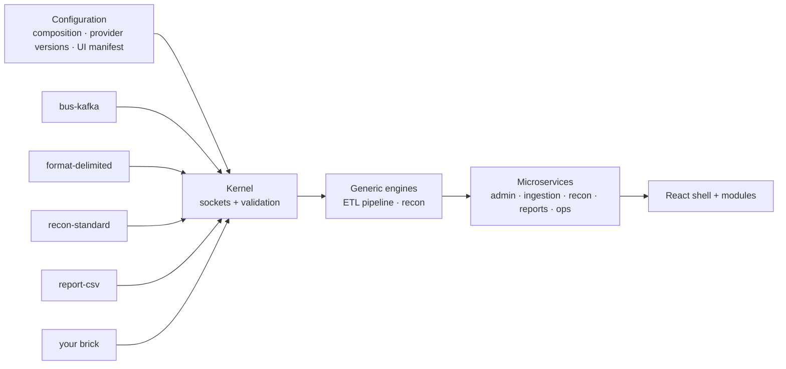

# reconArk

**A composable ETL and reconciliation platform.** reconArk:
- ingests transactions from any channel (files, APIs, queues) into one canonical model;
- reconciles them side against side by configured rules;
- explains every difference and reports on it;
- scales from a few hundred to 100M+ records per run, with each run finishing within 40 minutes.

reconArk is built like **Lego**. A small kernel knows only the *sockets* (extension points). Everything else is a
*brick* plugged in by configuration:
- connectors, decoders, formats;
- validators and pipeline stages;
- match strategies, comparators, classifiers;
- report renderers, the message bus, secrets and storage;
- whole microservices;
- UI modules.

Any brick can be added, removed or replaced without touching the core.



## Documentation

Start with the **[solution document](docs/solution/reconArk-solution-document.md)**. It covers our understanding,
the C4 model, architecture and flow diagrams, concepts, step-by-step scenarios, the tech stack (with learning curve
and alternatives), recommended enhancements and the roadmap. From there:
- [HLD](docs/hld/reconArk-HLD.md)
- [LLD](docs/lld/reconArk-LLD.md)
- [C4 workspace](docs/c4/workspace.dsl)
- [ADRs](docs/adr/README.md)
- [v0.1 baseline architecture](docs/architecture/reconArk-architecture.md)

## Repository map

| Path | Contents |
|---|---|
| `kernel/` | Plugin API, plugin runtime, pipeline engine (framework-free) |
| `domain/` | Canonical model, SPI (extension points), engines (core stages, recon engine) |
| `plugins/` | Bricks: `recon-standard`, `format-delimited`, `bus-kafka`, `bus-inmemory`, `secrets-env`, `storage-filesystem`, `report-csv` |
| `platform/` | Spring Boot starter (kernel auto-config, `/actuator/plugins`) and API conventions |
| `services/` | `web-bff`, `admin-api`, `ingestion-api`, `recon-api`, `reports-api`, `operations-api`, `scheduler`, `etl-worker`, `recon-worker`, `report-worker`, `outbox-relay` |
| `testing/` | Plugin TCK and ArchUnit rules |
| `frontend/` | React 19 shell + feature modules (npm workspaces) |
| `contracts/` | OpenAPI 3.1, AsyncAPI 3, gRPC ExtensionService |
| `config/` | Composition and provider configuration examples |
| `deploy/` | Local docker-compose, Helm chart (one chart, one release per service), Terraform interface |
| `docs/` | All design documentation |
| `CLAUDE.md`, `.claude/` | Rules, permissions, hooks and commands for Claude Code sessions |

## Build and run

Requirements:
- JDK 25;
- Node 22+;
- optionally Docker, for local infrastructure.

```bash
./gradlew build                      # compile (-Werror for kernel/domain/plugins), unit + TCK + ArchUnit tests
./gradlew verifyQuick                # fast loop: kernel, domain, plugins

cd frontend && npm ci && npm run build && npm test

# run an API with in-memory bricks, no infrastructure:
RECONARK_DEV_MODE=true ./gradlew :services:admin-api:bootRun
curl -s localhost:8081/api/admin/v1/plugins | jq '.[] | {id, state, contributions}'

# full local platform (PostgreSQL 18, Kafka, Valkey, MinIO, Keycloak, Grafana LGTM):
docker compose -f deploy/local/docker-compose.yml up -d
```

## Status

v0.2 is the composable design plus a runnable skeleton:
- **Implemented:** the kernel, the engines, seven bricks, the service skeletons and the UI shell.
- **Next:** persistence adapters (jOOQ, COPY, claims, outbox), production cloud bricks and the walking skeleton.

See the [roadmap](docs/solution/reconArk-solution-document.md#14-delivery-roadmap).
