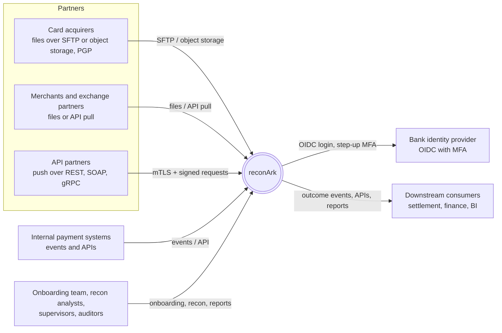
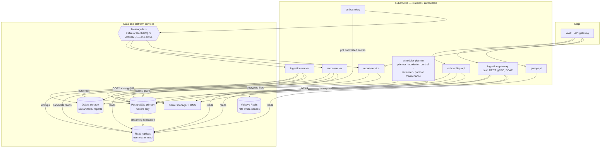
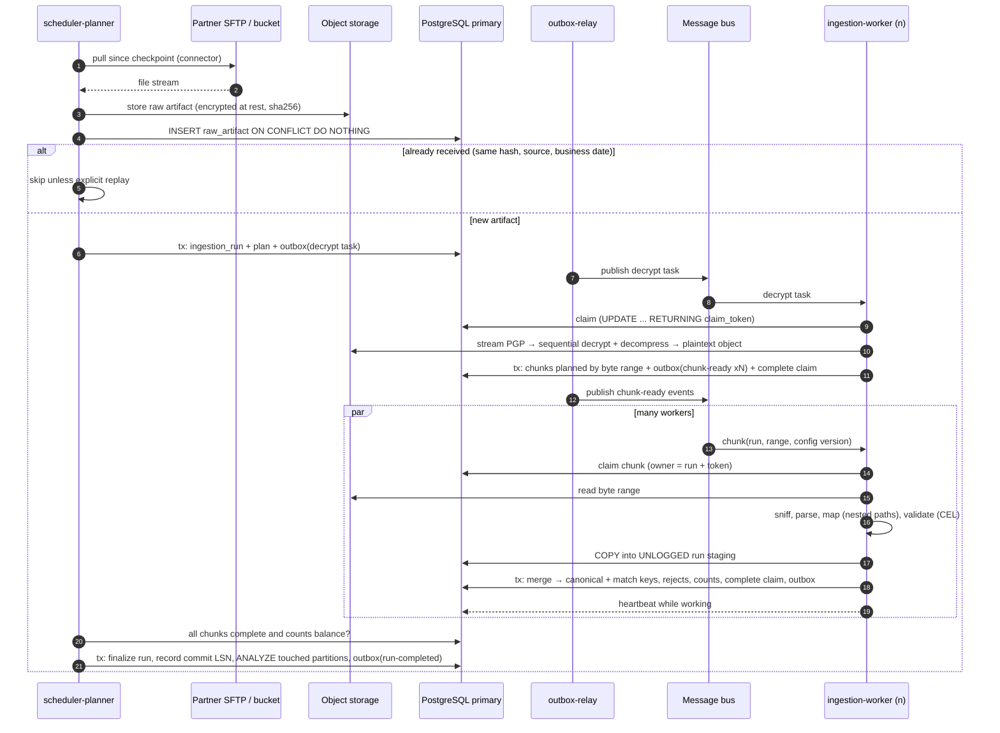
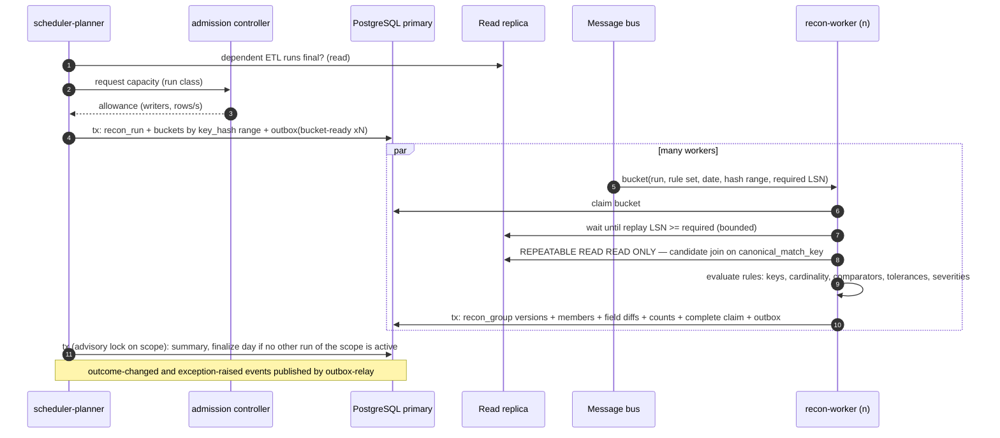
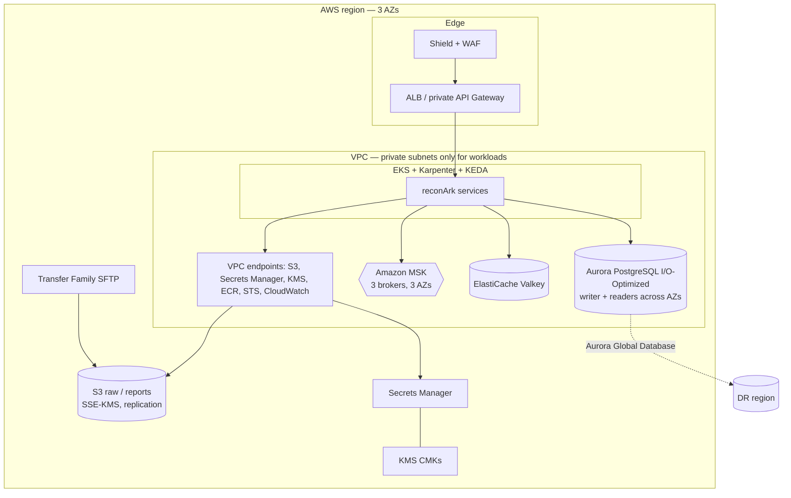
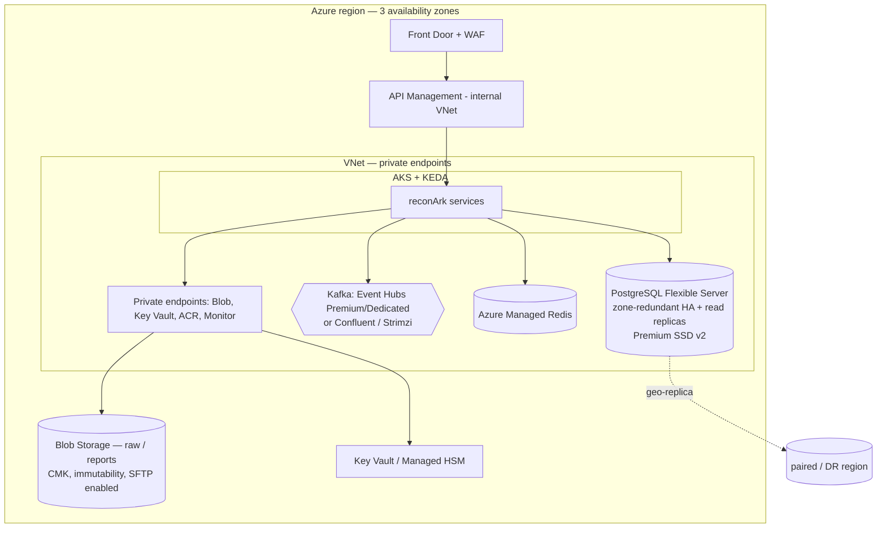
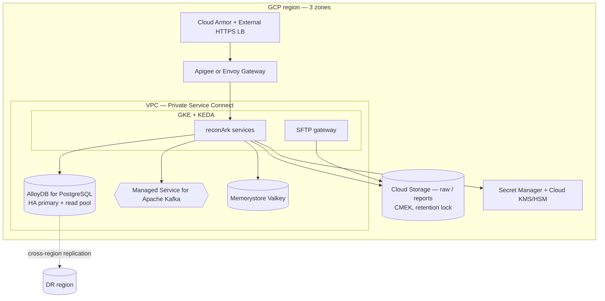

# reconArk — Architecture and Cloud Decisions

| | |
|---|---|
| Document | reconArk solution architecture, with AWS, Azure and GCP reference architectures |
| Status | Draft for architecture review |
| Version | 0.1 — 2026-10-02 |
| Companion | `../reference/reconArk-build-prompt.md` (build prompt; section numbers prefixed "P§" refer to it), diagram sources in `../diagrams/` and `../c4/`, ADR records in `../adr/` |
| Decision rule | Decisions in section 14 are the approved defaults. Changing one requires a new ADR that supersedes it. |

---

## 1. Purpose and scope

reconArk is a distributed platform with two responsibilities:

1. **ETL** — acquire transaction data from partners and internal systems over any channel (files over SFTP
   or object storage, REST, SOAP, gRPC, message queues), verify it, decrypt it, parse it (including records
   nested deep inside lists of objects), map and validate it, and store it as canonical records.
2. **Reconciliation** — pair canonical records across two sides by configured match keys, compare
   configured fields, classify every pair, explain every difference, re-reconcile as late data arrives,
   and report the results.

Posting, ledger files, settlement and payouts are out of scope. reconArk publishes outcomes as events, APIs
and reports; other systems act on them.

This document fixes the architecture, the data and transaction model, the concurrency and performance
model, the security model, and the deployment architecture on **AWS, Azure and GCP**. The decisions it
records are listed in section 14.

## 2. Requirements that shape the architecture

| # | Requirement | Architectural consequence |
|---|---|---|
| R1 | Any number of ETL and recon runs at once, fully isolated | Run-scoped data, claim ownership, fair scheduling, database admission control (sections 7.3–7.5) |
| R2 | A few hundred to 100M+ records per run | One adaptive pipeline; set-based database work; horizontal workers (7.2) |
| R3 | Every ETL or recon run ≤ 40 minutes | Capacity model with stage budgets, including the database IO budget (section 8) |
| R4 | The database is the shared, finite IO resource | Write-minimising load path; primary for writers only, replicas for every other read (6.3, 8.3) |
| R5 | ACID, deliberate isolation levels and transaction management | Transaction model (section 6) |
| R6 | Providers onboarded by configuration only, with deeply nested fields | Versioned configuration model; path-based mapping engine (5.1) |
| R7 | One of Kafka, RabbitMQ or ActiveMQ, exactly one active | `MessageBus` port with three adapters; startup validation (section 9) |
| R8 | Secrets only in a secret manager; only keys in properties | `SecretProvider` port; workload identity (10.5) |
| R9 | Excellent security for the onboarding and reports APIs; nothing a VAPT would flag | Security architecture (section 10) |
| R10 | Tables partitioned, with partitioning configured per table before setup | Partitioning configuration and DDL generation (6.2) |
| R11 | Distributed, fault tolerant, self-healing, resilient, auto-recovering | Stateless services, claims with heartbeats, sagas, outbox, chaos tests (section 12) |
| R12 | Real-time monitoring and excellent logging | OpenTelemetry end to end; SLOs; dashboards (section 11) |
| R13 | Java 25 LTS, latest stable stack, Gradle written from scratch, virtual threads where they help | Technology baseline (section 4) |
| R14 | Deployable on AWS, Azure or GCP | Portable core plus cloud adapters; per-cloud reference architectures (section 13) |

## 3. Architectural principles

1. **Configuration, not code, per provider.** One generic ETL pipeline and one generic recon engine.
   There are no per-provider classes.
2. **Hexagonal core.** The domain and application layers have no framework or cloud dependencies.
   Infrastructure sits behind ports: bus, secrets, keys, object storage, connectors, persistence.
3. **The database is the system of record, and its IO is a budget.** Writes go to the primary;
   everything else reads from replicas. Work is set-based, and bulk loads skip logging where the data
   can be rebuilt.
4. **At-least-once everywhere, effectively-once outcomes.** Idempotent writes, idempotent consumers,
   transactional outbox. No distributed transactions.
5. **Every unit of work is owned.** Claims carry a run id, claim token and heartbeat. Releases and
   reverts are scoped to the owner, and orphans are reclaimed automatically.
6. **Bad data never fails a run; bad configuration never starts one.**
7. **Secure by default.** Private networking; zero static credentials; least privilege at every layer;
   sensitive data masked everywhere it leaves the database.
8. **Prove it.** Each requirement has an automated test or an SLO dashboard. Performance, isolation and
   chaos suites run in CI.

## 4. Technology baseline

| Concern | Choice | Notes |
|---|---|---|
| Language/runtime | **Java 25 (LTS)** | Final features only; no `--enable-preview`. Virtual threads for IO-bound work; `ScopedValue` for context. |
| Framework | **Spring Boot 4.x** (Spring Framework 7, Spring Security 7) | Latest GA at project start. |
| Data access | **jOOQ** (typed SQL) + PgJDBC `CopyManager` for bulk load | ADR-016. No JPA on hot paths. |
| Database | **PostgreSQL 18** | Native `uuidv7()`, partitioning, logical/physical replication. ADR-002. |
| Migrations | **Flyway** | DDL for partitioned tables generated from the partitioning configuration (6.2). |
| Messaging | Kafka 4.x (default) / RabbitMQ / ActiveMQ Artemis behind `MessageBus` | ADR-007, ADR-008. |
| Expressions | **CEL** (Common Expression Language, cel-java) | Sandboxed by design; ADR-012. |
| Crypto | BouncyCastle (`jdk18on`) | PGP coverage as in P§2.1. |
| Build | **Gradle 9.x**, Kotlin DSL, written from scratch | Version catalog, `build-logic` convention plugins, dependency verification; ADR-014. |
| Telemetry | OpenTelemetry, Micrometer | Vendor-neutral, exported to each cloud's backend. |
| Runtime platform | Kubernetes (EKS, AKS or GKE), Helm, Argo CD (GitOps), KEDA | ADR-021. |
| Infrastructure | Terraform, per-cloud modules behind one module interface | Policy-as-code in CI. |

**Threading model.**

| Work | Executor |
|---|---|
| API requests, connector IO, secret and object-storage calls, consumer handlers that do IO, report streaming, outbox relay | Virtual thread per task (`newVirtualThreadPerTaskExecutor`), named |
| PGP decryption, decompression, parsing, hashing, rule evaluation | Bounded platform pools sized to cores |

Scarce resources are guarded explicitly, whatever the thread type: database pools per instance plus
semaphores, per-partner concurrency, broker in-flight limits, and memory per chunk.

## 5. Logical architecture

### 5.1 Context



### 5.2 Containers



| Container | Responsibility | Scales on |
|---|---|---|
| `onboarding-api` | Provider configuration lifecycle (draft → validate → dry-run → approve → activate), connector tests, mapping preview | Request rate |
| `ingestion-gateway` | Partner push endpoints (REST, gRPC, SOAP); authenticates (mTLS + signature), validates the envelope, stores the payload as a raw artifact, requests a run | Request rate |
| `scheduler-planner` | Schedules pulls; plans runs (volume → chunks or buckets); fair scheduling; admission control; heartbeat reclaimer; partition maintenance (leader-elected) | Singleton leader plus standby |
| `ingestion-worker` | Executes ETL chunks: decrypt, sniff, parse, map, validate, `COPY` to staging, merge, reject | Queue lag (KEDA) |
| `recon-worker` | Executes recon buckets and streaming matches: candidate read (replica), rule evaluation, outcome write | Queue lag (KEDA) |
| `report-service` | Asynchronous report generation and scheduled reports, from replicas to encrypted object storage | Queue lag |
| `query-api` | Recon results, diffs, exceptions, run status; all reads on replicas | Request rate |
| `outbox-relay` | Publishes committed outbox rows to the bus in order, marks them published | Outbox depth |

### 5.3 Code structure (Gradle modules)

```
reconark/
├─ settings.gradle.kts, gradle/libs.versions.toml, gradle/verification-metadata.xml
├─ build-logic/                    convention plugins: java, library, spring-service, quality, test-suites
├─ reconark-domain/                 canonical model, rule engine, comparators, matching — no frameworks
├─ reconark-application/            use cases, ports (WriteStore/ReadStore, MessageBus, SecretProvider, ...)
├─ reconark-api-contracts/          OpenAPI 3.1, .proto, WSDL + generated stubs/DTOs
├─ adapters/
│  ├─ persistence-postgres/         jOOQ, COPY, writer/reader data sources, LSN fencing
│  ├─ messaging-kafka/  messaging-rabbitmq/  messaging-activemq/
│  ├─ secrets-aws/  secrets-azure/  secrets-gcp/
│  ├─ storage-s3/  storage-blob/  storage-gcs/
│  ├─ connector-sftp/  connector-rest/  connector-soap/  connector-grpc/  connector-mq/  connector-sqs/
│  └─ crypto-pgp/
└─ apps/                            onboarding-api, ingestion-gateway, scheduler-planner,
                                    ingestion-worker, recon-worker, report-service, query-api, outbox-relay
```

Naming follows the prompt's P§16.4:
- packages are `<root>.<context>.<layer>`, with the root fixed by ADR-025 (placeholder `io.reconark`);
- modules are `reconark-*`;
- properties are `reconark.*`;
- codes are `RK-<AREA>-<NNNN>`.

Nothing is inherited from the legacy platform (P§2.4).

ArchUnit rules enforce:
- the domain has no framework imports;
- adapters never depend on each other;
- read code never depends on the writer store;
- only the bus port touches broker clients;
- only the secret port touches secret managers.

## 6. Data architecture and the transaction model

### 6.1 Data model summary

The full table specification is in P§11. In summary:

| Group | Tables |
|---|---|
| Configuration (versioned, immutable once approved) | `provider`, `provider_config_version`, `canonical_field`, `source`, `field_mapping`, `validation_rule`, `field_mapping_validation`, `reason_code`, `value_map`, `value_map_entry`, `recon_rule_set`, `recon_match_key`, `recon_compare_rule`, `report_definition` |
| ETL runtime | `raw_artifact`, `ingestion_run`, `work_chunk`, `canonical_record`, `canonical_match_key`, `reject_record` |
| Recon runtime | `recon_run`, `recon_group`, `recon_group_member`, `recon_field_diff`, `recon_exception`, `recon_exception_comment`, `recon_day_summary` |
| Reporting | `report_execution` |
| Platform | `outbox_event`, `processed_message`, `scheduler_lock`, `reconark_audit.audit_event` (hash-chained) |

Key properties:
- every runtime row carries its `run_id` and partition key;
- external ids are `public_id UUID DEFAULT uuidv7()`;
- money is `NUMERIC(19,4)` and time is `TIMESTAMPTZ`;
- invariants are database constraints, including count balance (`read = accepted + rejected +
  quarantined`) and maker ≠ checker.

### 6.2 Partitioning

Partitioning is configured per table in `reconark-partitioning.yaml` before installation. Flyway
migrations generate the DDL from it, and the service refuses to start if the live catalogue differs from
the configuration.

| Table group | Default |
|---|---|
| `canonical_record` | `RANGE(business_date)` daily, `HASH(source_id)` × 8 |
| `canonical_match_key` | `RANGE(business_date)` daily, `HASH(key_hash)` × 16 |
| `recon_group`, `recon_group_member`, `recon_field_diff` | `RANGE(business_date)` daily, `HASH(rule_set_id)` × 8 |
| `reject_record` | `RANGE(business_date)` daily |
| Run, chunk, artifact, exception, summary tables | `RANGE(business_date)` monthly |
| `outbox_event` / `processed_message` | `RANGE(created_at)` daily / `HASH(message_id)` × 16 |
| `audit_event` | `RANGE(occurred_at)` monthly |
| Configuration and lookup tables | `NONE` (explicit) |

Maintenance is a leader-elected job: it pre-creates partitions ahead, detaches and archives or drops
expired ones without blocking, and alerts on a shortfall. Retention never uses bulk `DELETE`.

### 6.3 Primary for writers, replicas for every other read

| On the primary | On replicas |
|---|---|
| Inserts, `COPY`, merges, updates | Recon candidate reads, match-key reads |
| Claims, heartbeats, state transitions (`UPDATE … WHERE … RETURNING`) | ETL reference and enrichment lookups |
| Idempotency and outbox inserts (`INSERT … ON CONFLICT`) | Configuration loads (then cached) |
| Day finalization, activation, approvals | Every API `GET`, reports, exports, dashboards |

- **Read-your-writes by LSN fencing.**
  - Each completed write unit records its commit LSN.
  - A dependent reader waits until its replica's `pg_last_wal_replay_lsn()` has passed that LSN. For
    example, recon waits for the ETL runs it depends on.
  - The wait is bounded; on timeout it tries another replica or backs off. It never reads stale data
    silently.
- **Routing.** Separate `writer` and `reader` data sources and separate ports. The reader uses a
  `SELECT`-only role. Replicas are load-balanced and pulled from rotation when their lag exceeds the
  budget. Long reports go to a dedicated replica where one exists.
- **No replica available.** `reconark.db.read-fallback-to-primary` decides whether reads fall back to
  the primary. It is off in production. When on, those reads count against the admission controller's
  budget and raise an alert.

### 6.4 ACID and isolation

| Property | How it is guaranteed |
|---|---|
| Atomicity | One unit of work = one transaction. For an ETL chunk: load, merge, counts, claim completion, outbox. For a recon bucket: outcome versions, diffs, counts, outbox. Retries redo the whole unit idempotently. |
| Consistency | Database constraints are the final guard; application validation comes first. |
| Isolation | Per-path levels (table below). |
| Durability | `synchronous_commit = on` and a synchronous standby in another zone for canonical data, outcomes, configuration and audit (RPO 0). Relaxed only for re-derivable `UNLOGGED` staging. |

| Path | Isolation | Mechanism |
|---|---|---|
| Claims, heartbeats, transitions, idempotency/outbox inserts, merges | `READ COMMITTED` | Single atomic statements under row locks |
| Work pickup | `READ COMMITTED` | `FOR UPDATE SKIP LOCKED` on `work_chunk` |
| Day finalization, configuration activation, exception approval | `SERIALIZABLE`, or `READ COMMITTED` + `pg_advisory_xact_lock(scope)` | Retry `40001`/`40P01` with jitter and a retry limit |
| Multi-query consistent reads on replicas | `REPEATABLE READ READ ONLY` | One snapshot; replicas never use `SERIALIZABLE` (not supported on hot standby) |

**Locking discipline.**
- Locks are taken in one global order (partition key, then id), so deadlocks can't form.
- Per-role `lock_timeout`, `statement_timeout` and `idle_in_transaction_session_timeout`.
- Transactions are short and bounded. Long reads are chunked and resumable.
- `hot_standby_feedback` and `max_standby_streaming_delay` are tuned deliberately and recorded in
  ADR-011.

**Across the database and the bus.**
- No XA or two-phase commit.
- The transactional outbox publishes events; consumers dedupe through `processed_message` in the same
  transaction as their effect.
- Run lifecycles are sagas (plan → chunks → merge → finalize) with idempotent, resumable steps.
- No network call happens inside an open transaction.

**In code.**
- `@Transactional` or `TransactionTemplate` only at application-service boundaries, with explicit
  isolation and timeout.
- `REQUIRES_NEW` only for records that must survive a rollback (failure records, audit entries).
- PgBouncer runs in transaction mode, so code uses `SET LOCAL` and transaction-scoped advisory locks
  only.

## 7. Processing architecture

### 7.1 ETL flow (file)



PGP decryption of a single file is one sequential stream and can't be split. The planner gives it one
worker running on a CPU-optimised pool, writes the plaintext to object storage, and splits only after
that. Its time is budgeted in section 8.

### 7.2 Recon flow (batch)



**Streaming recon** runs the same rules, triggered by `reconark.ingestion.record-canonicalized.v1` events. It does an indexed
point lookup of the counterpart on a replica (LSN-fenced) and a group claim on the primary.
Property-based tests prove that batch and streaming produce identical outcomes.

### 7.3 Planning and adaptive chunking
- The planner sizes each run from the artifact size or record count, and the measured throughput for
  that source.
- Runs up to about 50k records take one chunk on the fast path. Larger runs get chunks or buckets
  sized for 30–60 seconds of work.
- If the estimate exceeds 75 % of the 40-minute budget at current capacity, the planner asks KEDA and
  the node autoscaler to scale out first, and alerts if capacity can't be reached.

### 7.4 Fair scheduling and isolation
- Work items carry run class (real-time, small, large), run id and scope.
- Weighted fair queuing across runs, with per-provider caps, means a 100M-record run can't starve a
  100-record run.
- The same scope — (source, date) for ETL, (rule set, date) for recon — never runs twice concurrently;
  the second run waits unless it is a superseding replay.
- Data isolation: every write is run-scoped and every claim is owner-scoped.

### 7.5 Admission control (database capacity)
- The admission controller hands out database-capacity allowances (concurrent writers, rows or MB per
  second) per run class.
- It throttles adaptively from live signals: write latency, IO wait, WAL rate, replication lag,
  checkpoints, lock waits.
- Real-time and small runs keep reserved capacity.
- Workers feel back-pressure (they slow their message intake) before the database saturates.

### 7.6 Self-healing
- **Heartbeat reclaimer.** Claims whose heartbeat is older than the stale threshold go back to the
  queue, and their staging is truncated. Runs left by dead pods resume automatically.
- **Poison handling.** After bounded redeliveries a chunk dead-letters, the run is flagged, and other
  runs and chunks continue. The DLQ can be requeued through the operations API.
- **Partner failures.** Circuit breakers per provider, retries with jitter, and a resume checkpoint.
- **Drift and invariants.** Count-balance checks, a daily audit-chain verification, partition
  pre-creation, and a check that replica lag is within budget.

## 8. Performance and capacity model (40-minute ceiling)

The numbers below are an illustrative starting model. The performance harness must replace them with
measured values before sizing is signed off.

**Target.** 100M records in 2,400 s, about **42k records/s** sustained, with 25 % headroom.

| ETL stage (100M records, ~30 GB plaintext) | Budget | Notes |
|---|---|---|
| Acquire + verify (stream to object storage, hash) | 4 min | Parallel multipart download where the source allows it |
| PGP decrypt + decompress (single stream) | 4 min | Must sustain ≥ 150 MB/s on one core |
| Parse, map, validate (parallel chunks) | 9 min | CPU pools; scales with workers |
| `COPY` into `UNLOGGED` staging | 7 min | Binary COPY, many parallel writers within the database allowance |
| Set-based merge into canonical + match keys | 8 min | Logged; bounded per-chunk transactions |
| Finalize, `ANALYZE` the touched partitions | 2 min | |
| Headroom | 6 min | |

| Recon stage (100M + 100M records) | Budget | Notes |
|---|---|---|
| Candidate join per hash bucket (replica) | 10 min | Bucket size chosen so joins fit in `work_mem` (no temp spills) |
| Rule evaluation (workers) | 8 min | CPU pools |
| Outcome write (groups, members, diffs) | 12 min | Append-only versions, HOT-friendly status columns |
| Summary + finalize | 3 min | |
| Headroom | 7 min | |

**Database IO estimate (to validate).**
- Write volume:
  - canonical row ≈ 350 B, match key ≈ 120 B, their indexes ≈ 250 B → about **70 GB** for 100M records;
  - recon outcome (group + member + diff) ≈ 400 B → about **40 GB**.
- WAL: about 1.0–1.5× the logged data volume.
- Rate: an ETL run and a recon run sharing the 40-minute window need roughly **100–150 MB/s** of
  sustained write throughput on the primary, plus checkpoints.

The storage tier must deliver several times that with low latency; see the per-cloud database choices
in section 13. If the measured numbers exceed 75 % of the primary's ceiling under the noisy-neighbour
mix, ADR-024 applies: shard by provider group.

## 9. Messaging architecture

| Topic / queue | Key (ordering) | Producer | Consumer |
|---|---|---|---|
| `reconark.ingestion.artifact-received.v1` | source + business date | ingestion-gateway, scheduler | scheduler-planner |
| `reconark.ingestion.chunk-ready.v1` | run id | outbox-relay | ingestion-worker |
| `reconark.ingestion.record-canonicalized.v1` | rule set + match key | outbox-relay | recon-worker (streaming) |
| `reconark.recon.bucket-ready.v1` | run id | outbox-relay | recon-worker |
| `reconark.recon.outcome-changed.v1` | rule set + group | outbox-relay | downstream consumers |
| `reconark.recon.exception-raised.v1` | rule set | outbox-relay | exception workflow, notifications |
| `reconark.reporting.report-requested.v1` | requester | query-api, scheduler | report-service |
| `<topic>.dlq` | original key | adapters | operations API |

**Delivery semantics (all adapters):**
- at-least-once delivery;
- ordering per key;
- bounded redelivery with backoff, then DLQ;
- consumer dedupe by message id;
- trace context in headers;
- TLS and per-service ACLs.

The **database claim tables are the source of truth** for work. Messages are triggers. A lost or
duplicated message only delays or repeats a claim attempt; it never loses or doubles work (ADR-009).

## 10. Security architecture

### 10.1 Identity and access
- **Users:** the bank's IdP over OIDC (authorization code + PKCE), with MFA. Step-up (fresh MFA,
  `acr`/`amr`) is required for approval, exception resolution, unmasking and export.
- **Services:** workload identity per cloud (section 13), plus mTLS through the service mesh. There are
  no static credentials anywhere.
- **Partners (push):** mTLS with pinned client certificates, plus an HMAC/JWS signature over body,
  timestamp and nonce. Nonce and timestamp replay checks are held in Valkey/Redis.
- **Authorization:**
  - roles: `ONBOARDING_MAKER`, `ONBOARDING_CHECKER`, `RECON_ANALYST`, `RECON_SUPERVISOR`,
    `REPORT_VIEWER`, `REPORT_EXPORTER`, `PII_UNMASK`, `OPERATOR`, `AUDITOR`, `PARTNER_<code>`;
  - ABAC data scope (providers, dates), enforced in services and by PostgreSQL row-level security;
  - object-level checks on every `public_id`; out-of-scope returns 404;
  - maker ≠ checker, enforced in the service and as a database constraint.

### 10.2 API protection (onboarding, reports, ingestion, query)
- WAF and API gateway at the edge; operations APIs on an internal listener only.
- Contract-validated input:
  - unknown fields rejected;
  - limits on size, array length and nesting depth;
  - uploads sniffed and malware-scanned.
- `Idempotency-Key` on every mutation; `If-Match` with `row_version`; approvals bound to the reviewed
  `content_hash`.
- Rate limits per client and per user, tighter on export, unmask and preview; `429` with `Retry-After`.
- Strict token validation: JWKS, `iss`/`aud`/`exp`/`nbf`, algorithm allow-list, lifetime ≤ 15 min.
- Responses use RFC 9457 problem details with no internals, and security headers. Sensitive responses
  carry `no-store`.
- Report downloads use signed, single-use URLs valid for ≤ 5 minutes and bound to the user; scope is
  re-checked at download; downloads are watermarked and audited.

### 10.3 Application threats (VAPT checklist)
| Threat | Control |
|---|---|
| SQL injection | jOOQ / bind parameters only; identifiers from allow-lists |
| Expression injection | CEL: no reflection or IO, cost limits, checked at save time |
| XXE / XML bombs | DTDs and external entities off; secure processing; size and entity limits (SOAP, XML formats) |
| Deserialization | No Java serialization; Jackson default typing off; unknown properties rejected |
| SSRF | Per-provider egress allow-list; private, link-local and metadata ranges blocked after DNS resolution and on redirect |
| Path traversal | Remote and archive names normalised, sandboxed, never used directly in paths |
| Decompression bombs | Ratio, size, entry-count and depth limits; streaming |
| ReDoS | RE2/J with input limits |
| CSV/formula injection | Escaping in every CSV/XLSX export |
| Log injection | CR/LF and control characters encoded; structured logging |
| Data exposure | Field masking driven by metadata; column encryption for designated PII; customer-managed keys at rest |
| Supply chain | SBOM (CycloneDX); dependency and image scanning that blocks High/Critical; signed images; non-root, read-only containers |

CI runs SAST (SonarQube plus Semgrep/CodeQL), DAST (ZAP, authenticated, driven by OpenAPI), dependency,
container and secret scans, and the negative security tests. The quality gate requires 0 vulnerabilities,
0 unreviewed hotspots and duplication ≤ 1 %.

### 10.4 Data protection
- **In transit:** TLS 1.2+ (1.3 preferred) everywhere, with mTLS inside the cluster.
- **At rest:** customer-managed keys for the database, object storage, broker volumes, backups and
  reports.
- **Masking:** sensitive values are masked in logs, errors, rejects, diffs, reports and APIs. Unmasking
  needs `PII_UNMASK` plus step-up, and is audited.
- **Audit:** an append-only, hash-chained audit log, verified daily and streamed to the SIEM.

### 10.5 Secrets and keys
- Properties hold secret reference names only. Values live in the cloud secret manager, behind
  `SecretProvider`.
- Secrets are cached with a TTL and refresh on rotation; values are zeroed after use where possible.
- PGP private keys stay in the secret manager. Envelope encryption uses the cloud KMS, and an HSM where
  the bank's policy requires it.

## 11. Observability and operations

- **Logs:** structured JSON, carrying correlation, trace, run, chunk, provider, config version and the
  masked record key. One business event per line.
- **Traces:** OpenTelemetry from API through the bus to workers and the database, with context
  propagated in message headers.
- **Metrics:**
  - per provider and stage: records accepted, rejected and quarantined; throughput and lag;
  - recon outcomes and amounts;
  - run duration against the 40-minute budget;
  - claim age, DLQ depth, broker lag;
  - per database instance: IOPS, MB/s, IO wait, WAL rate, replication lag, LSN-fence wait, read-only
    statements on the primary (expected 0), temp bytes, checkpoints, pool wait;
  - auth failures and rate-limit rejections.
- **SLOs:**
  - ETL and recon run duration (p99 ≤ 40 min large, ≤ 2 min small);
  - streaming recon latency (≤ 60 s);
  - API availability and latency;
  - report generation time.

  Burn-rate alerts on each.
- **Alerts:**
  - file not received by its expected time;
  - reject rate or mismatch value above a threshold;
  - run at 75 % of budget;
  - stuck claims;
  - DLQ non-empty;
  - decryption or checksum failures;
  - replica lag above budget;
  - partition shortfall;
  - audit-chain failure.
- **Runbooks:** one per alert, with the automated remediation it triggers (if any) and manual steps.

## 12. Resilience and disaster recovery

| Tier | High availability | RPO | RTO (zone) | RTO (region) |
|---|---|---|---|---|
| Recon outcomes, canonical data, config, audit | Primary + synchronous standby in another zone; ≥ 2 read replicas across zones | 0 | ≤ 5 min (automatic failover) | ≤ 60 min |
| Raw artifacts, reports | Zone-redundant object storage; cross-region replication | 0 within region; ≤ 15 min cross-region | n/a | ≤ 60 min |
| Bus | Multi-zone cluster (Kafka RF=3, `min.insync.replicas=2`; quorum queues for RabbitMQ; HA pair or cluster for Artemis) | Outbox makes events replayable from the database | ≤ 5 min | ≤ 60 min |
| Services | Stateless; ≥ 3 replicas across zones; PodDisruptionBudgets | n/a | Seconds | ≤ 60 min (warm standby region) |

**DR strategy.**
- A warm standby region: database cross-region replica, object storage replication, infrastructure
  applied by Terraform, workloads scaled to zero.
- Quarterly game-day, covering failover, the run-recovery sagas and audit-chain continuity.
- Backups use point-in-time recovery, are encrypted with customer-managed keys, and restore-tested
  monthly into an isolated environment.

**Failure modes (abridged).**

| Failure | Detection | Automatic response |
|---|---|---|
| Worker pod killed mid-chunk | Heartbeat stale | Reclaim the chunk, truncate its staging, redeliver |
| Primary zone lost | Managed failover | Brief write pause; claims are idempotent, runs resume |
| Replica lagging | Lag metric | Pulled from rotation; LSN-fenced readers retry elsewhere |
| Broker node lost | Client errors | Retry; outbox keeps unpublished events; consumers dedupe |
| Partner API down | Circuit breaker | Back off; checkpoint holds the position; alert if past expected time |
| Poison record or chunk | Repeated failure | DLQ, run flagged, others continue |
| Secret rotated or expired | Auth error | Refresh from the secret manager; fail the run, not the pod |
| Database IO saturation | Admission signals | Throttle large runs; protect real-time and small runs |

## 13. Cloud reference architectures

### 13.1 Portability approach
Same code, same images and same Helm charts on every cloud. Only these differ per cloud, each behind a
port or a Terraform module:
- object storage;
- secret manager;
- KMS/HSM;
- SFTP intake;
- workload identity;
- database service;
- broker service;
- edge (WAF/gateway);
- telemetry backend.

### 13.2 Service mapping

| Capability | AWS | Azure | GCP |
|---|---|---|---|
| Kubernetes | EKS (+ Karpenter) | AKS (+ node autoprovisioning / cluster autoscaler) | GKE (Standard, node auto-provisioning) |
| PostgreSQL primary, HA standby, read replicas | **Aurora PostgreSQL (I/O-Optimized)**; alt: RDS for PostgreSQL Multi-AZ cluster | **Azure Database for PostgreSQL – Flexible Server** (zone-redundant HA, read replicas, Premium SSD v2) | **AlloyDB for PostgreSQL** (HA, read pools); alt: Cloud SQL for PostgreSQL Enterprise Plus |
| Write scale-out (ADR-024) | Shard by provider group (separate clusters); evaluate Aurora Limitless | Shard by provider group; evaluate Azure Cosmos DB for PostgreSQL (Citus) | Shard by provider group; self-managed Citus on GKE |
| Kafka (default bus) | Amazon MSK | Event Hubs (Kafka endpoint) — verify feature parity; or Confluent Cloud / Strimzi on AKS | Google Cloud Managed Service for Apache Kafka |
| RabbitMQ | Amazon MQ for RabbitMQ | RabbitMQ Cluster Operator on AKS | RabbitMQ Cluster Operator on GKE |
| ActiveMQ | Amazon MQ (ActiveMQ Classic — JMS adapter) or Artemis operator on EKS | Artemis operator on AKS | Artemis operator on GKE |
| Object storage | S3 (SSE-KMS, Object Lock for audit exports) | Blob Storage (CMK, immutability policies) | Cloud Storage (CMEK, retention locks) |
| SFTP intake | AWS Transfer Family → S3 | SFTP support for Blob Storage | SFTP gateway on GKE → GCS (no first-party managed SFTP) |
| Partner/internal queue sources | SQS/SNS connector (today's internal payment events) | Service Bus connector | Pub/Sub connector |
| Secrets | Secrets Manager | Key Vault | Secret Manager |
| Keys / HSM | KMS (+ CloudHSM if required) | Key Vault Managed HSM | Cloud KMS / Cloud HSM (+ External Key Manager if required) |
| Workload identity | EKS Pod Identity (or IRSA) | Microsoft Entra Workload ID | Workload Identity Federation for GKE |
| Edge, WAF, API gateway | AWS WAF + Shield, ALB; API gateway: Amazon API Gateway (private) or Envoy Gateway on EKS | Front Door / Application Gateway WAF; Azure API Management | Cloud Armor + Cloud Load Balancing; Apigee or Envoy Gateway on GKE |
| Cache (rate limit, nonces) | ElastiCache (Valkey) | Azure Managed Redis | Memorystore (Valkey) |
| Registry | ECR (image signing, scanning) | ACR | Artifact Registry |
| Telemetry | ADOT → CloudWatch, Amazon Managed Prometheus, Managed Grafana, X-Ray | Azure Monitor (managed Prometheus), App Insights (OTel), Managed Grafana | Cloud Monitoring (Managed Prometheus), Cloud Logging, Cloud Trace; Grafana |
| Security posture / SIEM | GuardDuty (incl. S3 malware protection), Security Hub, Inspector, CloudTrail | Defender for Cloud (incl. storage malware scanning), Sentinel | Security Command Center, Cloud Audit Logs; malware scanning via service on GKE |
| Private connectivity | VPC endpoints / PrivateLink | Private Endpoints / Private Link | Private Service Connect |
| Autoscaling on lag | KEDA | KEDA (AKS add-on) | KEDA |
| Backup / DR | AWS Backup, PITR, Aurora Global Database | Flexible Server PITR, geo-redundant backup, cross-region replica | AlloyDB/Cloud SQL PITR, cross-region replication |

### 13.3 AWS reference architecture



**Decisions (AWS):**
- **Database: Aurora PostgreSQL, I/O-Optimized configuration.**
  - Its replicas share the cluster storage, so replica lag is typically low. That suits replica-first
    reads and LSN fencing.
  - I/O-Optimized avoids per-IO charges, which matters for the bulk-load write volume.
  - Fallback: RDS for PostgreSQL Multi-AZ DB cluster (two readable standbys) if Aurora's PostgreSQL 18
    support or the cost model doesn't fit.
- **Bus:** Amazon MSK (Kafka); IAM or mTLS authentication; private connectivity only.
- **Intake:** AWS Transfer Family SFTP → S3, with GuardDuty malware protection on the intake bucket.
- **Identity:** EKS Pod Identity per service account; no IAM user keys.
- **Fit with today:** the current system already runs on AWS (S3, SQS, SNS, Secrets Manager). The
  internal payment events stay on SQS, consumed by the SQS source connector.
- **Residency:** an in-country region (UAE) for regulated data, subject to confirmation.

### 13.4 Azure reference architecture



**Decisions (Azure):**
- **Database:** Azure Database for PostgreSQL – Flexible Server, zone-redundant HA, read replicas, and
  Premium SSD v2 storage, so IOPS and throughput are provisioned independently of size.
- **Write scale-out:** sharding by provider group across Flexible Servers; Azure Cosmos DB for
  PostgreSQL (Citus) is evaluated in ADR-024.
- **Bus:**
  - Event Hubs exposes a Kafka endpoint. Confirm parity for the Kafka features used (consumer groups,
    ordering, idempotent producer, any transactions or compaction) before choosing it.
  - If any are missing, use Confluent Cloud on Azure, or Strimzi on AKS.
  - RabbitMQ and ActiveMQ have no first-party managed service on Azure; they run on AKS with operators.
- **Intake:** SFTP support for Blob Storage, with Defender for Storage malware scanning.
- **Identity:** Microsoft Entra ID for users (likely the bank's IdP already) and Entra Workload ID for
  pods.
- **Residency:** Azure has in-country UAE regions (UAE North, UAE Central), subject to confirmation of
  service availability there.

### 13.5 GCP reference architecture



**Decisions (GCP):**
- **Database:** AlloyDB for PostgreSQL. HA primary plus read pools fit replica-first reads, and its
  performance profile suits the bulk-load and analytical joins. Alternative: Cloud SQL for PostgreSQL
  Enterprise Plus.
- **Bus:** Google Cloud Managed Service for Apache Kafka. RabbitMQ and ActiveMQ run on GKE with
  operators.
- **Intake:** there is no first-party managed SFTP; run a hardened SFTP gateway on GKE writing to GCS.
  Uploads are scanned by a malware-scanning service on GKE.
- **Residency:** confirm in-country region availability for regulated data before choosing GCP as the
  primary.

### 13.6 Comparison and recommendation

| Criterion | AWS | Azure | GCP |
|---|---|---|---|
| Fit with the current estate (S3, SQS, SNS, Secrets Manager today) | **Strong** | Medium | Low |
| Managed PostgreSQL with replica-first reads at this write volume | Strong (Aurora) | Strong (Flexible Server + Premium SSD v2) | Strong (AlloyDB) |
| Managed Kafka | Strong (MSK) | Medium (Event Hubs Kafka endpoint; verify parity) | Strong (Managed Kafka) |
| Managed RabbitMQ / ActiveMQ | Yes (Amazon MQ) | No (operators on AKS) | No (operators on GKE) |
| Managed SFTP intake | Yes (Transfer Family) | Yes (Blob SFTP) | No (self-run gateway) |
| In-country UAE region | Yes (to confirm per service) | Yes (to confirm per service) | Verify |
| Enterprise identity integration | Good (OIDC to the bank's IdP) | **Strong** (Entra ID native) | Good |

**Recommendation:** AWS as the primary target, because of continuity with the current estate, Aurora
for replica-first reads, MSK, Transfer Family, and Amazon MQ if RabbitMQ or ActiveMQ is chosen. Azure is
the secondary target. Every component stays portable, so Azure or GCP remains a deployment choice
rather than a re-platforming. This is ADR-022, pending confirmation of the bank's cloud strategy and the
residency rules.

## 14. Architecture decision records

Format: **Decision** — why — **Consequences** — alternatives rejected.

| ADR | Decision | Rationale | Consequences | Rejected |
|---|---|---|---|---|
| 001 | Hexagonal, cloud-portable core; cloud specifics only in adapters and Terraform | R14; testability | More interfaces; ArchUnit enforcement | Cloud-native SDKs in business code |
| 002 | PostgreSQL 18 is the single system of record, including recon results and reporting reads | ACID, constraints, partitioning, replicas; team skills | Database IO is the budget (ADR-010, 024) | Separate warehouse for recon (sync complexity) |
| 003 | Writers on the primary; every other read on replicas, with LSN fencing for read-your-writes | R4 | Two data sources and ports; fence waits | Reads on the primary "for safety" |
| 004 | Configuration-driven partitioning, fixed before install; defaults per 6.2 | R10, pruning, cheap retention | DDL generation; drift check at startup | Hand-written partition DDL |
| 005 | Batch recon = database hash-bucket candidate join (replica) + rule evaluation in workers | Scales to 100M; minimal network transfer | Bucket sizing must avoid spills | In-memory JVM matching of whole days |
| 006 | Bulk load = binary `COPY` into `UNLOGGED` run staging, then set-based logged merge | Write and WAL minimisation (R4) | Staging rebuilt after a crash | Row inserts; logged staging |
| 007 | `MessageBus` port; exactly one broker active; transactional outbox; at-least-once + idempotent consumers | R7, R11 | Outbox relay service | XA / 2PC |
| 008 | Kafka is the default broker | Partitioned parallelism, ordering per key, replay, throughput | RabbitMQ/ActiveMQ remain supported via adapters | — |
| 009 | Database claim tables are the work source of truth; messages are triggers | Broker loss or duplication never loses or doubles work | Claim writes on the primary (small, single-statement) | Broker-only work tracking |
| 010 | Admission controller allocates database capacity per run class | R1, R4 | Central scheduler component | Unbounded worker writes |
| 011 | Isolation per path (6.4); short transactions; ordered locking; no long replica queries | R5 | Retry handling for `40001`/`40P01` | One global isolation level |
| 012 | CEL for all expressions | Sandboxed by design; prevents expression injection | Migration of legacy expression rules | JEXL (needs a hardened sandbox) |
| 013 | Java 25 LTS, Spring Boot 4; virtual threads for IO, platform pools for CPU; no preview features | R13 | Pinning checks in performance tests | Reactive stack (complexity) |
| 014 | Gradle 9 Kotlin DSL written from scratch; convention plugins in `build-logic`; dependency verification | R13; no duplicated build logic | Initial build effort | Copying the legacy build |
| 015 | No Spring Batch; a purpose-built planner + claims + bus | Distributed chunking across pods; the legacy platform's local-partition state bugs; job-repository write load on the primary | Owning orchestration code (tested) | Spring Batch remote partitioning |
| 016 | jOOQ for typed SQL; PgJDBC `CopyManager` for bulk load; no JPA on hot paths | Set-based SQL, predictable statements | SQL skills needed | JPA/Hibernate |
| 017 | OIDC with the bank's IdP + MFA and step-up; ABAC + row-level security; mTLS + signatures for partners | R9 | IdP integration work | API keys alone |
| 018 | Secrets only in the cloud secret manager; workload identity; no static credentials | R8 | Secret caching with rotation | Secrets in properties or the database |
| 019 | Reports generated asynchronously from replicas to encrypted object storage; signed single-use URLs | R4, R9 | Report service and queue | Synchronous large exports |
| 020 | OpenTelemetry end to end, exported to each cloud's backend | R12, portability | Collector operations | Vendor agents in code |
| 021 | Terraform + Helm + Argo CD (GitOps); policy-as-code; drift detection | Repeatable, auditable deployments | Platform skills | Console changes |
| 022 | AWS primary, Azure secondary, GCP supported | Section 13.6 | Adapters for all three tested in CI | Single-cloud lock-in |
| 023 | Valkey/Redis only for rate limits, nonce windows and short caches; never a system of record | Data integrity | Cache can be lost safely | Redis-held work state (as in the legacy platform) |
| 024 | Scale writes by sharding per provider group (separate PostgreSQL clusters) when one primary can't meet the budget | Keeps run isolation; linear write scale | Routing by provider configuration; cross-shard reports go through replicas | Single giant primary; immediate move to distributed SQL |
| 025 | Clean-room naming: own package root (placeholder `io.reconark`), module, property, topic, metric and code conventions; no legacy identifiers | Avoids coupling to the legacy model; consistent vocabulary | Legacy values only translated in outbound adapters; a deny-list check in CI | Reusing legacy names "for familiarity" |

## 15. Risks and mitigations

| Risk | Impact | Mitigation |
|---|---|---|
| A single primary can't sustain the write budget under peak concurrency | 40-minute breach | Admission control; measured capacity model; ADR-024 sharding ready by design |
| Single-stream PGP decryption becomes the bottleneck for very large files | ETL stage overrun | Dedicated CPU-optimised decrypt; partners asked to split very large files; measured in the harness |
| Replica lag spikes during bulk load | Recon waits on LSN fences | Lag-aware routing; dedicated report replica; merge rate governed by the admission controller |
| Broker managed-service gaps (Event Hubs Kafka parity, no managed RabbitMQ/ActiveMQ on Azure/GCP) | Operational load | Verify parity first; operators with runbooks; Kafka as the default |
| Configuration errors at onboarding | Wrong recon results | Schema validation, dry-run against samples, maker-checker, versioning with rollback |
| Expression or connector abuse (injection, SSRF) | Security incident | CEL, SSRF guard, egress allow-lists, negative tests, DAST |
| Migration from the legacy platform | Outcome differences | Parallel run with automated outcome diffing before cut-over |

## 16. Open decisions to confirm

1. Primary cloud, region(s) and data-residency rules (ADR-022).
2. Real volumes per run and per day, peak concurrency, and the reference infrastructure for the
   40-minute ceiling.
3. Database tier and storage class per cloud (validates section 8).
4. Broker for the first environment (Kafka assumed).
5. IdP, MFA and step-up capabilities; roles and data scopes; maker-checker owners.
6. Retention per data class; archive format and location.
7. Regulatory frameworks in scope (central-bank IT controls, PCI DSS if card data is in scope, ISO
   27001) and the VAPT sign-off owner.
8. Legacy transition: parallel run duration and acceptance criteria.

## 17. Verify at project start

These depend on vendor release status at the time of build. Confirm each one and record it in the ADR
log:
- the latest GA versions of Java 25 patch, Spring Boot 4.x, Gradle 9.x, PostgreSQL 18 minor, Kafka 4.x,
  BouncyCastle, CEL-Java, jOOQ;
- PostgreSQL 18 availability on Aurora, Azure Flexible Server and AlloyDB/Cloud SQL in the chosen
  regions;
- Event Hubs Kafka-endpoint parity for the features used;
- Amazon MQ ActiveMQ engine version and Jakarta JMS client compatibility;
- managed SFTP, malware scanning and Managed HSM availability in the chosen regions;
- Error Prone / NullAway compatibility with Java 25;
- PgBouncer version with protocol-level prepared-statement support.

## 18. Glossary

| Term | Meaning |
|---|---|
| Canonical record | One transaction from any source, normalised to reconArk's model |
| Rule set | Configured pairing of two sources with match keys, comparators and time rules |
| Recon group | One evaluated pairing (1:1, 1:N or N:1), versioned |
| Chunk / bucket | A unit of ETL work / a unit of batch recon work (hash range) |
| Claim | Ownership of a chunk, bucket or group, with run id, token and heartbeat |
| LSN fence | Waiting until a replica has replayed up to a given primary commit position |
| Admission controller | Allocates database capacity to runs and throttles them |
| Outbox | Table of events written in the same transaction as the state change, published after commit |
