# reconArk — High-Level Design (HLD)

| | |
|---|---|
| Document | High-level design for the composable ("Lego") reconArk platform |
| Version | 0.2 — 2026-10-05 |
| Status | Draft for architecture review |
| Builds on | [`../architecture/reconArk-architecture.md`](../architecture/reconArk-architecture.md) (v0.1 baseline). That document still governs the data model, transactions, performance, messaging semantics, security controls and cloud mapping. This HLD **supersedes its §5 (logical architecture)** and adds the composability model. |
| Companions | [C4 model](../c4/workspace.dsl) · [LLD](../lld/reconArk-LLD.md) · [Solution document](../solution/reconArk-solution-document.md) · [ADRs](../adr/README.md) |

---

## 1. What changed from v0.1

v0.1 was already partly modular: infrastructure sat behind ports (bus, secrets, storage, connectors).
But composability stopped at the adapter level:

- the 8 services were fixed;
- the ETL and recon pipelines were hard-wired step sequences;
- the APIs were bundled by technical role;
- there was no UI design.

v0.2 makes **every capability a replaceable block**:

| Area | v0.1 | v0.2 |
|---|---|---|
| Infrastructure adapters | Ports with adapters, chosen at build time | **Extensions** with manifests, chosen and configured at deploy time through a *composition* file |
| Pipeline | Fixed ETL steps in code | **Stage graph** declared per provider configuration; stages are extensions |
| Recon rules | Configured comparators in one registry | The same, and the registry is now the generic **extension registry**, so new comparators, match strategies and classifiers are plugins |
| Services | 8 services | 12 services by **bounded context**. Each one can be switched on or off per environment, and they can be collapsed into a "lite" topology. |
| APIs | onboarding-api, query-api, report-service | **admin-api, recon-api, reports-api, ingestion-api, operations-api**, behind an API gateway and a **web-bff** |
| UI | Not designed | **React shell + feature modules**, enabled by a UI manifest |
| Third-party extension | Not possible without a fork | **Out-of-process plugins** over a gRPC contract, plus a **TCK** that every plugin must pass |

## 2. Architecture drivers

The v0.1 requirements R1–R14 still apply. v0.2 adds these composability requirements:

| # | Requirement | Measure |
|---|---|---|
| C1 | Any capability can be **added** without changing core code | A new format, connector, comparator or renderer ships as a new module plus a config entry. Zero edits outside its module. |
| C2 | Any capability can be **removed** | Removing a plugin is one config change. Startup fails fast if anything still references it. |
| C3 | Any capability can be **replaced** | Swapping Kafka for RabbitMQ, or AWS Secrets Manager for Vault, is a config change plus a redeploy. No code change. |
| C4 | Pipelines are **declared**, not coded | ETL and recon stage order, stage options and error policy come from the provider's configuration version |
| C5 | Services are **independently deployable** and optional | Each service has its own image and Helm release. An environment chooses which services it runs. |
| C6 | The UI is **composable** | Feature modules are enabled per environment and per role through a manifest |
| C7 | Plugins are **safe** | Trust tiers, signature verification, sandboxing for untrusted code, config validated against a schema before activation |
| C8 | Plugins are **interchangeable** | Each extension point has a Technology Compatibility Kit (TCK). A plugin that doesn't pass the TCK can't be released. |

## 3. Principles ("Lego rules")

1. **The kernel knows extension points, never implementations.** The core and the engines depend on SPI
   interfaces only. The `ExtensionRegistry` supplies the implementation the composition selected.
2. **One contract per extension point, one TCK per contract.** Plugins are interchangeable because they
   pass the same tests.
3. **Composition is data.** Which plugins run, how they are configured and how they are bound is
   versioned configuration. It lives in Git for platform composition and in the database, with
   maker-checker, for business configuration.
4. **Fail fast at boot, not at 2 a.m.** These all stop the service at startup with a precise `RK-KRN-*`
   error:
   - unknown plugin;
   - missing binding;
   - incompatible version;
   - invalid plugin config;
   - unmet plugin dependency;
   - a dev-only plugin in production.
5. **Cross-cutting concerns live once, in the kernel.** Interceptors wrap every extension, so plugins never
   re-implement them. The concerns are:
   - metrics, tracing, timing;
   - error masking, timeouts and circuit breaking;
   - audit.
6. **In-process by default, out-of-process when trust or language demands it.** The hybrid plugin model
   (ADR-0026).
7. **Services are Lego too.** One Helm chart, one release per service. A service is "kernel + starter +
   chosen plugins + its bounded-context use cases".
8. **The v0.1 invariants stay:**
   - writes on the primary, reads on replicas;
   - claims as the source of truth for work;
   - the outbox;
   - the 40-minute budget;
   - clean-room naming.

## 4. C4 Level 1 — System context

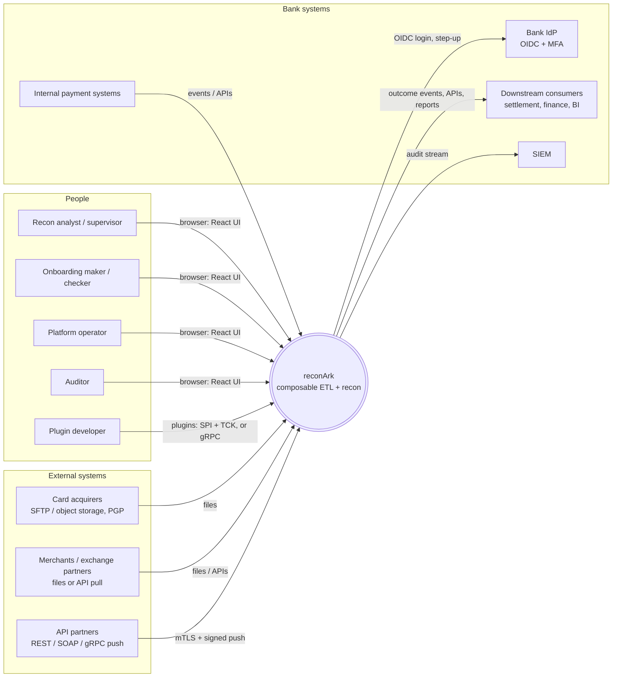

## 5. C4 Level 2 — Containers

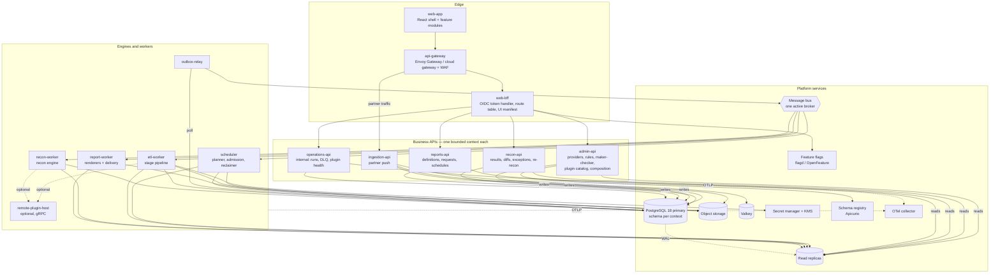

| Container | Bounded context / responsibility | Scales on | Key extension points used |
|---|---|---|---|
| `web-app` | UI shell plus modules (admin, recon workbench, reports, operations) | CDN | UI module contract |
| `api-gateway` | TLS, WAF, rate limits, partner mTLS, routing | Requests | (infrastructure) |
| `web-bff` | Session ↔ token exchange, route table, UI manifest, CSRF | Requests | — |
| `admin-api` | **Onboarding and configuration**: providers, sources, mappings, validation rules, rule sets, value maps, reason codes, maker-checker, plugin catalog, environment composition | Requests | all (reads schemas), `pipeline-stage` (dry-run) |
| `ingestion-api` | **Partner push**: REST/gRPC/SOAP, signature and replay checks, raw artifact, run request | Requests | `format-reader`, `object-store`, `message-bus` |
| `recon-api` | **Recon results**: results, diffs, exceptions workflow, re-recon, preview | Requests | `field-comparator` (preview) |
| `reports-api` | **Reporting**: definitions, requests, schedules, signed downloads | Requests | `report-renderer` (catalog) |
| `operations-api` | **Operations** (internal listener only): runs, pause/resume/replay, DLQ, plugin inventory | Requests | registry inventory |
| `scheduler` | Planning, admission control, fair scheduling, reclaimer, partition maintenance | Leader + standby | `source-connector` (pull) |
| `etl-worker` | ETL chunk execution | Queue lag (KEDA) | `payload-decoder`, `content-sniffer`, `format-reader`, `field-extractor`, `record-validator`, `enricher`, `pipeline-stage` |
| `recon-worker` | Batch buckets and streaming matches | Queue lag (KEDA) | `match-strategy`, `field-comparator`, `outcome-classifier` |
| `report-worker` | Report generation and delivery | Queue lag | `report-renderer`, `report-delivery` |
| `outbox-relay` | Ordered publication of committed events | Outbox depth | `message-bus` |
| `remote-plugin-host` | Runs out-of-process extensions | Requests | (hosts plugins) |

## 6. The Lego model — five kinds of blocks

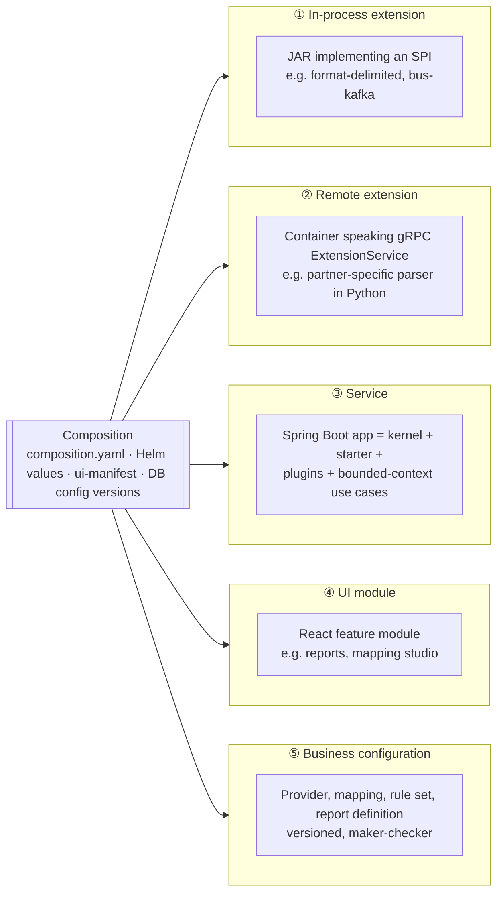

| Block | Granularity | Added / removed / replaced by | Who decides | Change control |
|---|---|---|---|---|
| ① In-process extension | One capability, e.g. a CSV reader | Module on the classpath, plus an entry in `reconark.composition` | Platform team | Git PR → CI (TCK) → GitOps |
| ② Remote extension | One capability, any language, isolated | Deployment, plus a `remote` entry in the composition | Platform team / partner | Git PR → CI (TCK over gRPC) → GitOps |
| ③ Service | One bounded context | Helm release on/off (`services.<name>.enabled`) | Platform team | GitOps |
| ④ UI module | One feature area | `ui-manifest` entry (plus role filter) | Product owner | Git PR or admin UI |
| ⑤ Business configuration | One provider or rule set | Admin UI / API | Onboarding maker + checker | Maker-checker, versioned, effective-dated |

**Runtime toggles** (OpenFeature flags) sit on top. They switch already-installed behaviour on or off
per environment, tenant or user, for example a beta report or a new matching strategy for one rule
set. They never install code.

## 7. Extension point catalogue

Cardinality:
- **SINGLE** — exactly one active binding;
- **KEYED** — many active, selected by key from business config;
- **CHAIN** — an ordered list.

| Extension point | Cardinality | Used by | Shipped plugins (default **bold**) | Typical additions |
|---|---|---|---|---|
| `message-bus` | SINGLE | all | **bus-kafka**, bus-rabbitmq, bus-activemq, bus-inmemory (dev) | bus-pubsub, bus-servicebus |
| `secret-provider` | SINGLE | all | **secrets-aws**, secrets-azure, secrets-gcp, secrets-vault, secrets-env (dev only) | — |
| `object-store` | SINGLE | ingestion, etl, reports | **storage-s3**, storage-blob, storage-gcs, storage-filesystem (dev) | storage-minio |
| `kms` | SINGLE | etl, reports | **kms-aws**, kms-azure, kms-gcp | HSM adapters |
| `source-connector` | KEYED | scheduler | **sftp**, **object-store**, **rest-pull**, soap, grpc, mq, sqs | partner-specific API |
| `payload-decoder` | KEYED | etl-worker | **pgp**, **gzip**, zip | jwe, age |
| `content-sniffer` | KEYED | etl-worker | **magic-bytes** | — |
| `format-reader` | KEYED | etl-worker, ingestion-api | **delimited**, **json**, json-lines, xml, fixed-width, excel, avro, protobuf | iso20022, mt940, swift |
| `field-extractor` | KEYED | etl-worker | **jsonpath**, xpath | jmespath |
| `record-validator` | CHAIN | etl-worker | **cel-rule**, required, type, range, regex (RE2/J) | luhn, iban |
| `enricher` | CHAIN | etl-worker | **reference-lookup**, value-map | fx-rate, bin-lookup |
| `pipeline-stage` | KEYED | etl-worker | **decode, sniff, parse, extract, validate, enrich, canonicalize** | dedupe, pii-tokenize, ml-anomaly |
| `match-strategy` | KEYED | recon-worker | **one-to-one**, one-to-many, many-to-one | fuzzy, ml-assisted |
| `field-comparator` | KEYED | recon-worker, recon-api | **exact**, **case-insensitive**, **numeric-tolerance**, **date-window**, **value-map**, regex, cel-expression | — |
| `outcome-classifier` | SINGLE | recon-worker | **standard-classifier** | bank-specific |
| `report-renderer` | KEYED | report-worker | **csv**, xlsx, pdf | parquet, json |
| `report-delivery` | KEYED | report-worker | **object-store-link**, sftp-push | email, sharepoint |
| `notifier` | KEYED | scheduler, recon-worker | **bus-event** | email, slack, teams |
| `audit-sink` | CHAIN | all | **db-hash-chain**, siem-stream | — |

## 8. Composition — three layers of configuration

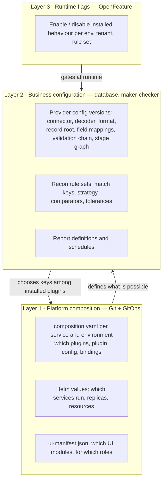

- **Layer 1 decides what exists.** If `format-reader: excel` isn't installed in the etl-worker's
  composition, no provider can select it. The admin-api validator rejects the provider version at save
  time, with `RK-CFG-0102 unknown extension key`.
- **Layer 2 decides what is used.** A provider version names keys: `format: delimited`,
  `decoder: [pgp, gzip]`, `comparator: numeric-tolerance`. These are validated against the plugin's
  config schema.
- **Layer 3 decides what is active right now.** For example, `recon.strategy.fuzzy.enabled` for rule
  set RS-12.

Example service composition (etl-worker, AWS production):

```yaml
reconark:
  composition:
    environment: prod
    enabled: [core-stages, decoder-pgp, format-delimited, format-json, recon-standard, secrets-aws, storage-s3]
    plugins:
      bus-kafka:        { config: { bootstrap-servers: "${KAFKA_BOOTSTRAP}", security-protocol: SSL } }
      remote-iso20022:  { remote: { endpoint: "dns:///plugin-iso20022:9443", timeout: PT2S, max-batch: 500 } }
    bindings:
      message-bus: kafka
      secret-provider: aws
      object-store: s3
    disabled: [ format-excel ]
```

Swapping the broker means changing `bus-kafka` to `bus-rabbitmq` and `message-bus: kafka` to
`message-bus: rabbitmq`, then redeploying. Nothing else changes. See
[`config/composition/`](../../config/composition/) for complete examples.

## 9. Configuration-driven pipelines

### 9.1 ETL stage graph

A provider configuration version declares its stage graph. The defaults reproduce the v0.1 ETL flow
exactly. Providers add, remove or reorder stages without code.

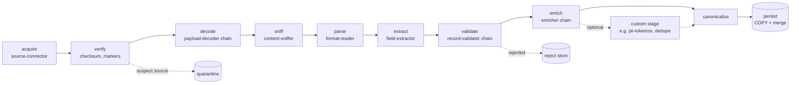

Each stage declares:
- its extension key;
- its options, validated against the plugin's schema;
- an **error policy**:
  - `reject-record` (default);
  - `quarantine-source`;
  - `fail-run` (configuration and infrastructure errors only).

The kernel wraps every stage with metrics, tracing, timing and masking. Reject-and-continue,
`read = accepted + rejected + quarantined`, and claim ownership all stay engine invariants. A plugin
can't bypass them.

### 9.2 Recon pipeline

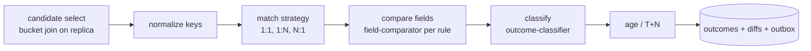

Batch and streaming recon use the same compiled recon pipeline. They differ only in candidate
selection: a bucket join for batch, a point lookup for streaming.

## 10. Microservices and their interactions

### 10.1 Communication rules
- **Browser → BFF → APIs** over HTTPS.
  - The browser holds only an HttpOnly, SameSite=Strict session cookie.
  - The BFF attaches a short-lived access token per call (ADR-0031).
- **Partners → gateway → ingestion-api**, with mTLS plus a signature.
- **Service ↔ service:**
  - synchronous calls are allowed only for queries;
  - every state change across contexts travels as an **event through the outbox** (at-least-once,
    idempotent consumers).
- **Commands to workers** are DB claims plus bus triggers (v0.1 ADR-0009).

### 10.2 Bounded contexts and data ownership

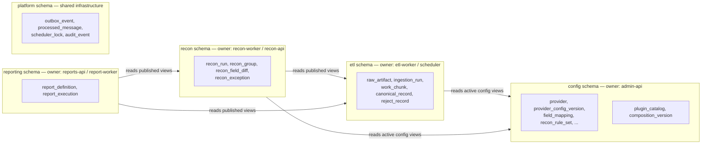

- One PostgreSQL cluster (v0.1 ADR-0002) with a **schema per bounded context** (ADR-0030).
- Only the owning service's database role can write a schema.
- Other contexts read only through `*_v1` **published views** on replicas.
- A context can move to its own cluster later (ADR-0024 sharding) without changing its consumers'
  contracts.

### 10.3 Deployment topologies (services are Lego too)

| Topology | What runs | When |
|---|---|---|
| **Full** | All 12 services, scaled independently | Production at bank scale |
| **Standard** | APIs + scheduler + etl-worker + recon-worker + outbox-relay; report-worker merged into reports-api via `reconark.reports.worker.embedded=true` | Mid-size environments |
| **Lite** (roadmap) | `reconark-lite` modular monolith: all contexts in one JVM, same modules, same composition files | Local dev, demos, small entities |

## 11. Frontend architecture

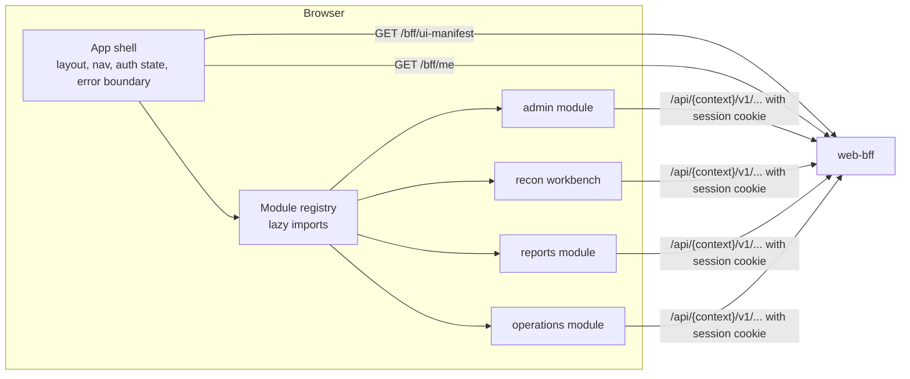

- **Shell + modules.**
  - The shell owns layout, navigation, authentication state and errors.
  - Each **feature module** exports a `ReconArkUiModule`: id, title, routes, nav items, required roles.
- **Manifest-driven.**
  - The BFF returns the UI manifest, filtered by environment composition, feature flags and the user's
    roles.
  - The shell only lazy-loads modules listed there.
  - A module removed from the manifest disappears without a rebuild.
- **Schema-driven forms.**
  - Plugin configuration and provider stage options are rendered from the JSON Schema each plugin
    publishes.
  - Adding a plugin adds its configuration form automatically. That's Lego for the UI.
- **Independent deployment, later.**
  - Modules are build-time packages today.
  - When separate teams own modules, switch to Module Federation remotes with the same module
    contract (ADR-0032).

## 12. Key flows

### 12.1 Plugin boot (every service)

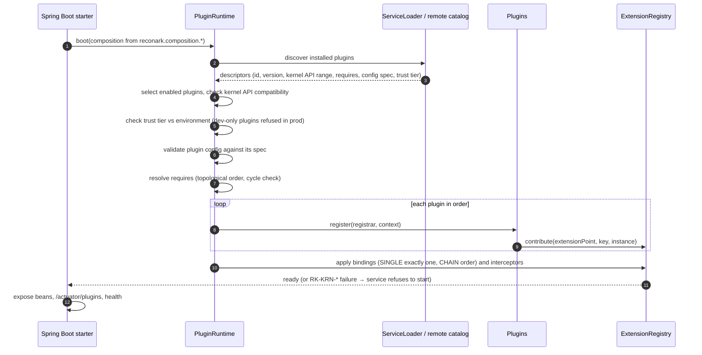

### 12.2 Replacing a block (example: RabbitMQ instead of Kafka)

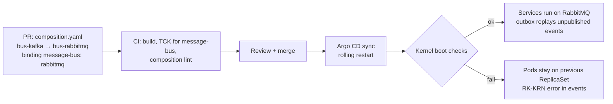

### 12.3 Adding a block (example: new ISO 20022 format reader)

1. Scaffold `plugins/format-iso20022` with `/new-plugin` (Claude Code command) or the template.
2. Implement `FormatReader`. Declare the descriptor and its config spec.
3. Extend `FormatReaderTck`. CI fails until it passes.
4. Add the module to the etl-worker and ingestion-api distributions. Enable it in their `composition.yaml`.
5. Deploy. The admin UI shows the new key and its schema-driven options form automatically.
6. Onboarding makers select `format: iso20022` in a provider version → dry-run → maker-checker → activate.

### 12.4 Onboarding a provider (business configuration, no code)

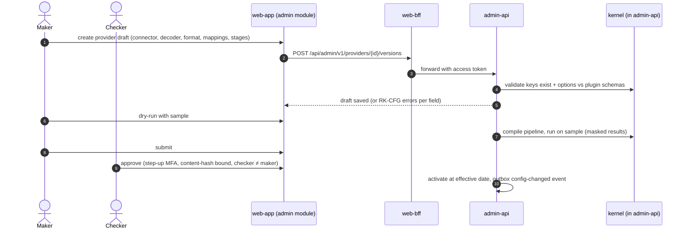

### 12.5 File ingestion, batch and streaming recon, crash recovery
These are unchanged from v0.1. See architecture §7.1–7.6 and diagrams `docs/diagrams/03`–`07`. In
v0.2, each worker step resolves its behaviour through the extension registry instead of fixed classes.

## 13. Security deltas

| Topic | Control |
|---|---|
| Plugin trust tiers | `CORE` (signed, first-party), `VERIFIED` (signed, TCK-passed, third-party), `DEV_ONLY` (refused when `environment=prod`), `REMOTE` (out-of-process only) |
| Supply chain | Plugin JARs and images signed (Sigstore/cosign); the kernel verifies against an allow-list of plugin ids and versions per environment; SBOM per plugin |
| Remote plugins | mTLS with SPIFFE identities; network policy restricts which services reach which plugin host; payload limits; deadline per call; circuit breaker; plugins see masked data unless their descriptor declares, and the composition approves, `needs-sensitive-fields` |
| Config injection | Plugin config validated against its spec before activation; secret fields hold reference names only and are resolved by the `secret-provider` |
| Browser | BFF token handler: no tokens in JavaScript; CSRF tokens; strict CSP; same-site cookies |
| Admin of composition | Composition changes are Git PRs (2-person review) or admin-api changes with maker-checker; every change is audited |

## 14. Observability for blocks
- Every extension call is timed and traced by the kernel interceptor, with metrics such as
  `reconark_extension_calls_total{point,key,plugin,outcome}` and `reconark_extension_duration_seconds`.
- `/actuator/plugins` and operations-api `GET /api/ops/v1/plugins` list each plugin's id, version,
  trust tier, state, bound points and health.
- Plugin health feeds readiness. An unhealthy SINGLE binding, for example the bus, makes the pod
  not-ready.

## 15. Quality-attribute scenarios (modifiability)

| Scenario | Response measure |
|---|---|
| A developer adds a new file format | ≤ 1 day; changes only inside one new module plus composition; core untouched (ArchUnit) |
| Ops replaces the broker | Config + redeploy; zero code change; no message loss (outbox) |
| A provider needs a new pre-processing step | Provider config version adds the stage; maker-checker; no deployment if the stage plugin is installed |
| A bank entity doesn't need reports | `reports-api`, `report-worker` disabled in Helm values; UI module hidden by manifest |
| A partner supplies its own Python parser | Packaged as a remote plugin; passes the TCK over gRPC; enabled per environment |

## 16. Risks of composability

| Risk | Mitigation |
|---|---|
| Plugin sprawl and inconsistent quality | TCK per extension point; plugin review checklist; deprecation policy |
| Version drift between kernel and plugins | Semantic versioning of the SPI; kernel API range in each descriptor; boot-time compatibility check; compatibility matrix in CI |
| Performance overhead of indirection | In-process calls are direct after boot (interceptor is one indirection); remote plugins are batched (≥ 500 records/call) and kept off the 100M-record hot path unless measured |
| Configuration complexity | Composition lint in CI; schema-driven UI; dry-run; sensible defaults; "golden" compositions per environment |
| Security of third-party code | Remote-only for untrusted code; signing; network isolation; masked data by default |
