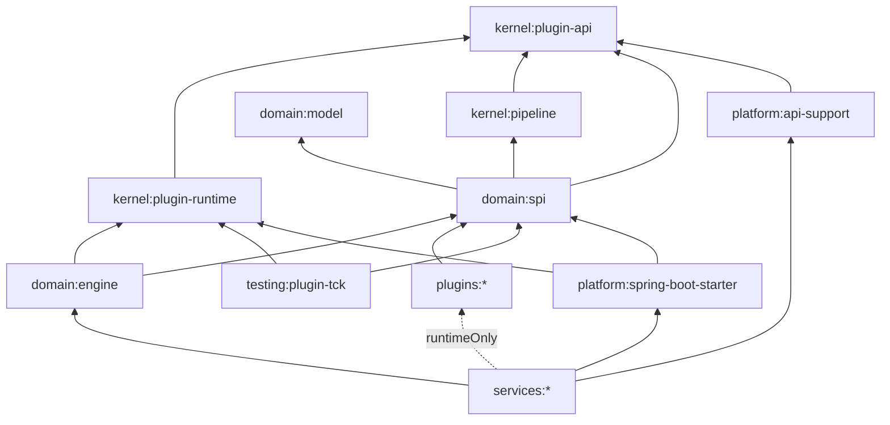
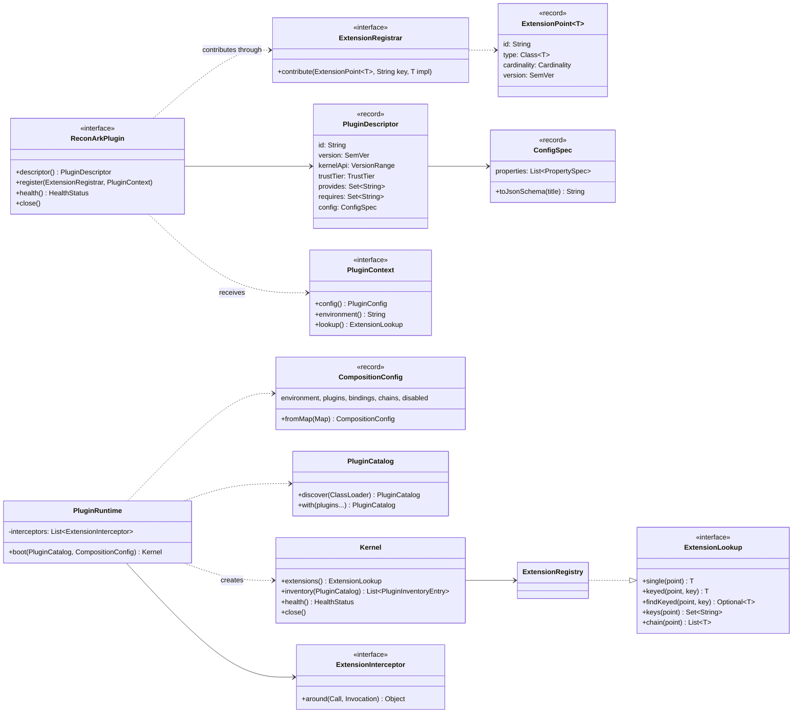
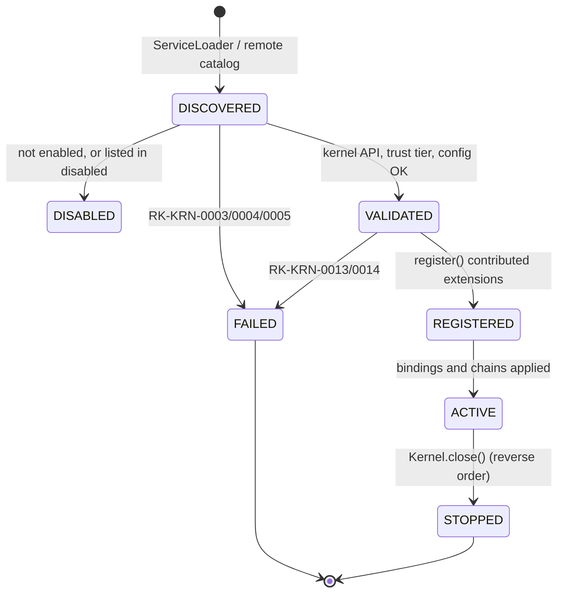
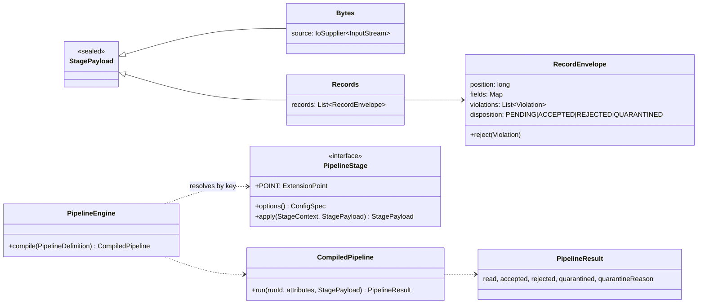
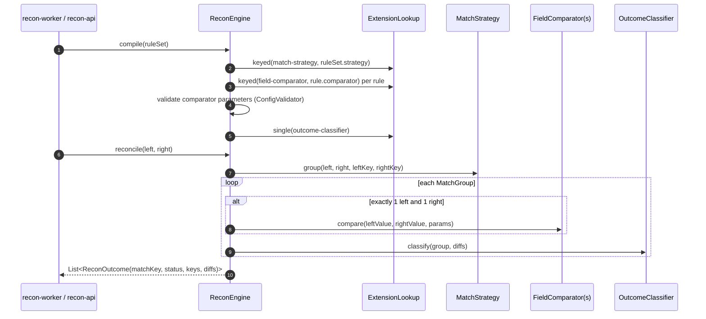
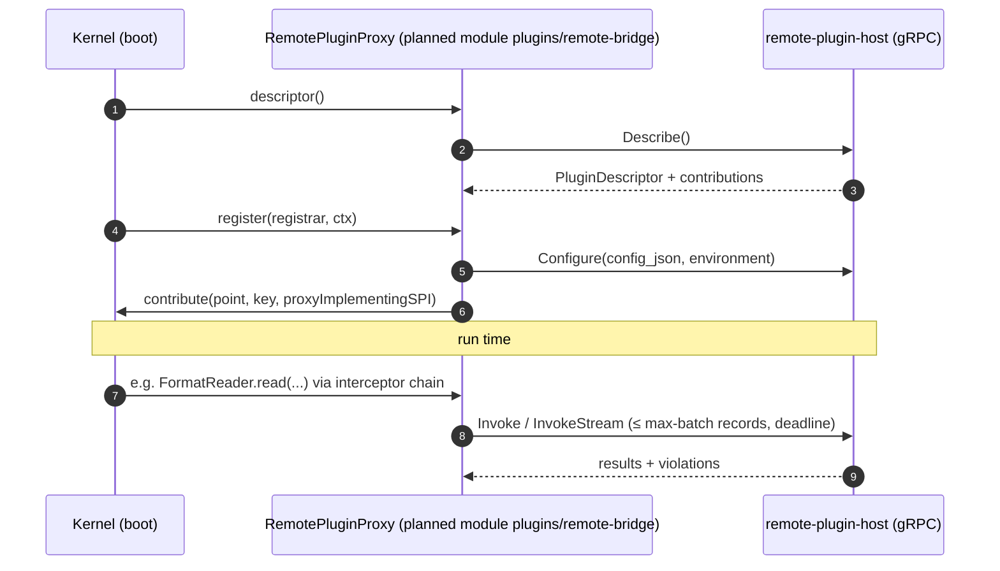
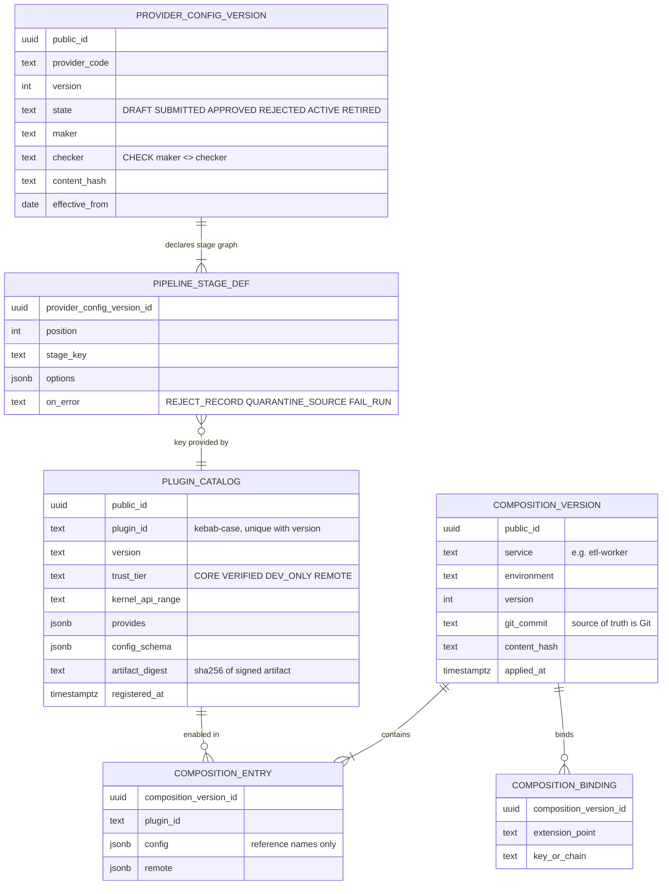
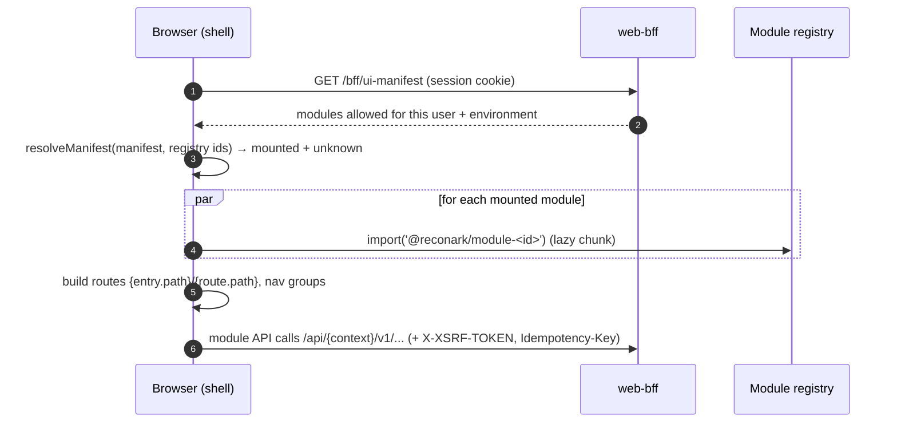
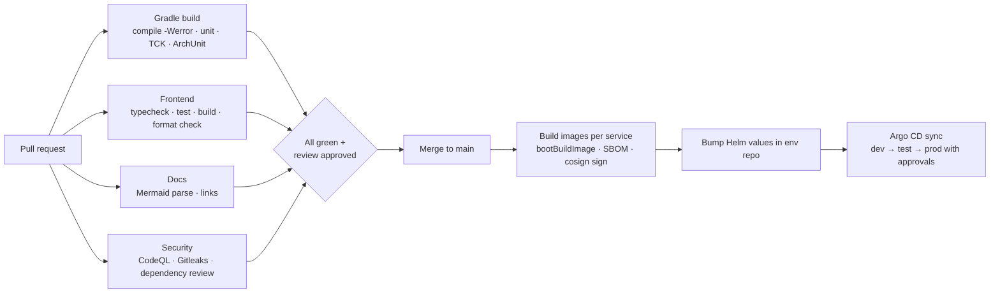

# reconArk — Low-Level Design (LLD)

| | |
|---|---|
| Document | Low-level design of the composable reconArk platform: kernel, SPI, engines, services, UI, data, CI |
| Version | 0.2 — 2026-10-05 |
| Status | Draft for architecture review. Matches the code on `main`; when they disagree, fix one in the same PR. |
| Reads with | [HLD](../hld/reconArk-HLD.md) (the why and the big picture) · [v0.1 architecture](../architecture/reconArk-architecture.md) (data model, transactions, performance, security, clouds) |

---

## 1. Repository and module structure

```text
reconArk/
├─ CLAUDE.md, .claude/                 AI-assisted development rules, permissions, hooks, commands (ADR-0037)
├─ settings.gradle.kts, build.gradle.kts, gradle/libs.versions.toml, build-logic/   Gradle 9 Kotlin DSL (ADR-0014)
├─ kernel/
│  ├─ plugin-api/        ReconArkPlugin, PluginDescriptor, ExtensionPoint, ConfigSpec, ExtensionLookup ... (JDK only)
│  ├─ plugin-runtime/    PluginCatalog, CompositionConfig, PluginRuntime, ExtensionRegistry, Kernel, interceptors
│  └─ pipeline/          PipelineStage, PipelineEngine, RecordEnvelope, StagePayload, ErrorPolicy
├─ domain/
│  ├─ model/             CanonicalRecord, MaskingPolicy
│  ├─ spi/               ExtensionPoints + every extension contract (MessageBus, FormatReader, FieldComparator ...)
│  └─ engine/            core-stages plugin (parse, map, validate, canonicalize), ReconEngine
├─ plugins/              one Gradle module per brick (recon-standard, format-delimited, bus-kafka, ...)
├─ platform/
│  ├─ spring-boot-starter/   kernel auto-configuration, metrics interceptor, /actuator/plugins
│  └─ api-support/           JWT resource server, role mapping, problem details, dev-mode
├─ services/             web-bff, admin-api, ingestion-api, recon-api, reports-api, operations-api,
│                        scheduler, etl-worker, recon-worker, report-worker, outbox-relay
├─ testing/
│  ├─ plugin-tck/            abstract suites per extension point (ADR-0035)
│  └─ architecture-tests/    ArchUnit Lego-boundary rules
├─ frontend/             npm workspaces: apps/shell, packages/module-sdk, modules/{admin,recon,reports,operations}
├─ contracts/            OpenAPI 3.1, AsyncAPI 3, Protobuf (ADR-0034)
├─ config/               composition examples (layer 1), provider examples (layer 2)
├─ deploy/               docker-compose (local), Helm chart (one chart, many releases), Terraform interface
└─ docs/                 HLD, LLD, solution document, C4, diagrams, ADRs, v0.1 baseline
```

### 1.1 Dependency rules



Enforced by Gradle module boundaries and by `testing/architecture-tests` (ArchUnit):

| Rule | Why |
|---|---|
| `io.reconark.kernel..` depends on nothing but the JDK (no Spring, no domain, no plugins) | The baseplate must outlive every brick and framework |
| `io.reconark.domain..` and `io.reconark.spi..` never depend on Spring or plugins | Engines see contracts only (ADR-0001, ADR-0026) |
| Plugins never depend on each other | A brick must be removable without breaking another |
| Plugins never depend on Spring | Bricks run in services, tests and the remote plugin host alike |
| `ReconArkPlugin` implementations are `public final` | ServiceLoader discovery; no subclassing |
| Only `io.reconark.plugins.bus.kafka..` touches `org.apache.kafka..` | Broker isolation (ADR-0007) |
| Services list plugins as `runtimeOnly` | Services compile against SPI only; which bricks ship is a distribution choice |

## 2. Plugin kernel (C4 level 4)

### 2.1 Class diagram



### 2.2 Plugin lifecycle



### 2.3 Boot algorithm (`PluginRuntime.boot`)

1. Mark every catalogued plugin `DISCOVERED`.
2. For each entry in `composition.plugins` (the `enabled` ids plus the `plugins` map), skipping any in `disabled`:
   1. Look it up in the catalog, or fail with `RK-KRN-0001`.
   2. Check `kernelApi.contains(KernelApi.VERSION)`, or fail with `RK-KRN-0003`.
   3. Refuse `DEV_ONLY` plugins when the environment is `prod`, and `REMOTE` plugins without a `remote`
      endpoint (`RK-KRN-0004`).
   4. Validate the config against its `ConfigSpec`. Apply defaults, coerce types, reject unknown keys, and
      report *all* problems (`RK-KRN-0005`).
3. Build the dependency graph. Each `requires` point id must be provided by some enabled plugin
   (`RK-KRN-0006`). Topologically sort the graph and detect cycles (`RK-KRN-0007`).
4. Register each plugin in order through a **scoped registrar**:
   - a contribution must target a point declared in `provides` (`RK-KRN-0014`) and must be the right type
     (`RK-KRN-0011`);
   - keys are unique per point (`RK-KRN-0010`);
   - each implementation is wrapped by the interceptor chain;
   - an exception thrown from `register` becomes `RK-KRN-0013`.
5. Apply bindings and chains:
   - each key must exist (`RK-KRN-0009`);
   - a SINGLE point with more than one contribution needs a binding (`RK-KRN-0008`).
6. Seal the registry. Mark plugins `ACTIVE` and the rest `DISABLED`.
7. If anything fails, close the plugins already registered in reverse order, then rethrow. The service does
   not start.

### 2.4 Composition reference (`reconark.composition.*`)

| Key | Type | Meaning |
|---|---|---|
| `environment` | string | `local`, `dev`, `test`, `prod`, ... `prod` refuses `DEV_ONLY` bricks |
| `enabled` | list of plugin ids | Plugins active with default configuration |
| `plugins.<id>.config` | map | Plugin configuration, validated against the plugin's `ConfigSpec` |
| `plugins.<id>.remote.endpoint` / `.timeout` / `.max-batch` | string / duration / int | Run the brick out-of-process (§6) |
| `bindings.<point>` | key | The active implementation of a SINGLE point |
| `chains.<point>` | list of keys | Order of a CHAIN point |
| `disabled` | list of plugin ids | Switched off; wins over `enabled` and `plugins` |

### 2.5 Versioning and compatibility
- **Kernel API**: `KernelApi.VERSION` (now `1.0.0`). A MAJOR bump means plugins must be rebuilt. Plugins declare
  a range such as `[1.0,2.0)`.
- **Extension point contracts** carry their own `SemVer`:
  - adding a default method is MINOR;
  - changing or removing a method is MAJOR, and it introduces a new point id (`format-reader-v2`) that runs
    alongside the old one until plugins migrate.
- **Plugin versions** are SemVer. The production composition pins versions through the Gradle distribution
  (version catalog) and the plugin allow-list (ADR-0035).

### 2.6 Kernel error codes

| Code | Meaning | Typical fix |
|---|---|---|
| RK-KRN-0001 | Composition enables a plugin that is not installed | Add the module to the service distribution, or fix the id |
| RK-KRN-0002 | Two installed plugins share an id | Remove the duplicate JAR |
| RK-KRN-0003 | Plugin does not support this kernel API | Upgrade the plugin |
| RK-KRN-0004 | Trust tier not allowed (DEV_ONLY in prod, REMOTE without endpoint) | Use a production brick |
| RK-KRN-0005 | Invalid plugin or stage configuration | Fix the listed properties |
| RK-KRN-0006 | Required extension point not provided | Enable a plugin that provides it |
| RK-KRN-0007 | Plugin dependency cycle | Break the cycle (redesign the requires) |
| RK-KRN-0008 | SINGLE point has several candidates and no binding | Add `bindings.<point>` |
| RK-KRN-0009 | Binding or chain names an inactive key | Fix the key, or enable the plugin |
| RK-KRN-0010 | Same key contributed twice to a point | Rename one key |
| RK-KRN-0011 | Contribution has the wrong type | Plugin bug |
| RK-KRN-0012 | Lookup of a key that is not active (also returned by admin-api at save time) | Use an active key |
| RK-KRN-0013 | Plugin threw during registration | See cause; check its configuration and dependencies |
| RK-KRN-0014 | Plugin contributed to a point it did not declare | Plugin bug: fix `provides` |

### 2.7 Interceptors
- `ExtensionInterceptor.around(Call(pointId, key, pluginId, method), next)` wraps every call to every extension,
  using a JDK dynamic proxy over the point's interface.
- Interceptors are applied in order, and the first one is the outermost.
- Shipped:
  - `MicrometerExtensionInterceptor` produces the `reconark.extension.calls` timer, tagged with
    `point, key, plugin, method, outcome`.
- Planned:
  - tracing (OpenTelemetry span per call);
  - a timeout and bulkhead for remote bricks;
  - an exception masking interceptor, so no plugin exception leaks data into logs.

## 3. SPI — extension point contracts

| Point (cardinality) | Contract (package `io.reconark.spi`) | Notes |
|---|---|---|
| `message-bus` (SINGLE) | `publish(BusMessage)`, `subscribe(topic, group, Handler) → AutoCloseable` | At-least-once, per-key order, bounded redelivery then `<topic>.dlq` |
| `secret-provider` (SINGLE) | `resolve(reference) → SecretValue` | `SecretValue` zeroes on close; `toString()` masked |
| `object-store` (SINGLE) | `put(key, stream, meta) → sha256`, `open`, `openRange(offset, length)`, `exists` | Keys confined to the store (no traversal) |
| `source-connector` (KEYED) | `poll(options, checkpoint) → Poll(items, nextCheckpoint)`, `open(options, item)` | Checkpoint persisted after storage |
| `payload-decoder` (KEYED) | `decode(in, options, secrets) → InputStream` | Streaming; PGP per build prompt §2.1 |
| `format-reader` (KEYED) | `options() → ConfigSpec`, `read(in, options, Sink)` | Only bytes → field maps |
| `record-validator` (KEYED) | `validate(record, options) → List<Violation>` | Returns all violations |
| `enricher` (KEYED) | `enrich(record, options)` | Idempotent |
| `pipeline-stage` (KEYED) | `options() → ConfigSpec`, `apply(StageContext, StagePayload) → StagePayload` | §4 |
| `match-strategy` (KEYED) | `group(left, right, leftKey, rightKey, options) → List<MatchGroup>` | §5 |
| `field-comparator` (KEYED) | `parameters() → ConfigSpec`, `compare(l, r, params) → Comparison` | Null-safe (TCK) |
| `outcome-classifier` (SINGLE) | `classify(MatchGroup, diffs) → OutcomeStatus` | |
| `report-renderer` (KEYED) | `mediaType()`, `fileExtension()`, `render(ReportData, options, out)` | CSV/XLSX escape formulas |
| `notifier` (KEYED) | `notify(type, subject, attributes)` | Masked attributes only |
| `audit-sink` (CHAIN) | `record(at, actor, action, attributes)` | Hash-chained DB first, then SIEM |

## 4. Pipeline engine



**Run semantics** (`CompiledPipeline.run`):
1. Stages execute in order. The first stage that returns `Records` defines `read`.
2. After each record stage:
   - envelopes marked `REJECTED` move to the reject list;
   - only `PENDING` envelopes flow on.
3. When a stage throws, its `onError` policy applies:
   - `QUARANTINE_SOURCE` quarantines every record of the unit and returns a result with `quarantineReason`;
   - `REJECT_RECORD` and `FAIL_RUN` both throw `PipelineFailure`. The unit is retried by the claim mechanism,
     and the run is flagged after bounded attempts.
4. Remaining `PENDING` envelopes become `ACCEPTED`. `PipelineResult` enforces
   `read = accepted + rejected + quarantined`. A constructor violation is a bug, never silently ignored.

**Core stages** (plugin `core-stages`, module `domain/engine`):

| Key | Options | Behaviour |
|---|---|---|
| `parse` | `format` (format-reader key), `format-options` (map) | Bytes → records via the named reader; reader options validated against its spec |
| `map` | `fields: {<canonical>: {source, type: string\|decimal\|integer\|date, pattern, required, default, sensitive}}` | Type conversion and required checks; RK-MAP-0001 missing, RK-MAP-0002 invalid; sensitive values masked in messages |
| `validate` | `rules: [{validator: <key>, options: {...}}]` | Runs `record-validator` bricks, collecting every violation |
| `canonicalize` | `record-key-field`, `business-date-field` | Checks the canonical core (RK-CAN-0001), stamps `_record_key`, `_business_date` |
| `required` (validator) | `fields: [..]` | RK-VAL-0001 per missing field |

Nested-path extraction (JSONPath/XPath, build prompt §6.4) arrives as `field-extractor` bricks used by a `extract`
stage before `map`; paths are compiled at save time.

## 5. Recon engine



- **Match key:** the configured fields are joined with `|` after normalisation (`TRIM`, `UPPER_CASE`,
  `STRIP_LEADING_ZEROS`, `REMOVE_SEPARATORS`).
- **Classification** (`standard` classifier):

  | Group | Status |
  |---|---|
  | > 1 record on either side | `DUPLICATE` (policy "flag both") |
  | Left only | `UNMATCHED_LEFT` |
  | Right only | `UNMATCHED_RIGHT` |
  | Any BLOCKING diff | `MISMATCHED` |
  | Only WARNING diffs | `MATCHED_WITH_WARNINGS` |
  | No diffs | `MATCHED` |

- **Sensitive rules:** values are masked to their last four characters in diff explanations.
- **Standard comparators:**

  | Key | Parameters (defaults) |
  |---|---|
  | `exact` | — |
  | `case-insensitive` | — |
  | `numeric-tolerance` | `scale` (2), `rounding` (HALF_UP), `absolute` ("0"), `percent` ("0") |
  | `date-window` | `timezone` (Asia/Dubai), `window` (PT0S = same calendar day) |
  | `value-map` | `mapping` (required, right value → canonical value), `ignore-case` (true) |

- **Batch and streaming:** both call the same `CompiledRuleSet`. A property-based test compares them on random
  data (roadmap, build prompt §8).

## 6. Remote plugins (out-of-process bricks)



- **Contract:** `contracts/proto/extension_service.proto`, with the RPCs `Describe`, `Configure`, `Invoke`,
  `InvokeStream` and `Health`.
- **Composition:** `plugins.<id>.remote.{endpoint, timeout, max-batch}`. The descriptor's trust tier is `REMOTE`.
- **Resilience:**
  - a deadline per call;
  - a circuit breaker per plugin (Resilience4j in the bridge);
  - idempotent invocations, so retries are safe;
  - health feeds readiness.
- **Security:**
  - mTLS with SPIFFE identities;
  - a NetworkPolicy, so only the consuming service can reach the plugin host;
  - payload limits;
  - masked fields unless the descriptor declares `needs_sensitive_fields` and the composition approves it.
- **Performance:** keep remote bricks off the 100M-record hot path unless measured. Batching amortises the round
  trip (target < 2 ms per 500-record batch in-cluster).

## 7. Spring Boot integration (`platform/spring-boot-starter`)

| Bean | Condition | Purpose |
|---|---|---|
| `PluginCatalog` | missing bean | `ServiceLoader` discovery plus any `ReconArkPlugin` beans (e.g. remote proxies) |
| `Kernel` (destroy = close) | missing bean | Boots from `ReconArkCompositionProperties`; logs the inventory; failures stop startup |
| `ExtensionLookup` | missing bean | Injected into services and engines |
| `MessageBus`, `ObjectStore`, `SecretProvider` | lazy | Convenience beans for SINGLE points |
| `MicrometerExtensionInterceptor` | Micrometer on classpath | Extension call metrics |
| `PluginsEndpoint` (`/actuator/plugins`) | Actuator on classpath | Inventory: state, contributions, health, config schema |

`platform/api-support` provides:
- a stateless JWT resource server, with the `roles` claim mapped to `ROLE_*`;
- `@EnableMethodSecurity`;
- RFC 9457 problem details, with `KernelException` → 422 and code `RK-KRN-*`;
- `dev-mode` (local only, refused in prod, with `X-Dev-User` for maker-checker testing).

## 8. Services

| Service | Port | Endpoints / topics | Bricks it carries (runtimeOnly) | Active locally |
|---|---|---|---|---|
| web-bff | 8080 | `/bff/me`, `/bff/ui-manifest`, `/api/{context}/**` proxy | — | — |
| admin-api | 8081 | `/api/admin/v1/plugins`, `/extension-points`, `/providers/{code}/versions[/{v}/dry-run\|submit\|approve]` | format-delimited, recon-standard, report-csv, bus-*, secrets-env, storage-filesystem | core-stages, format-delimited, recon-standard, report-csv |
| ingestion-api | 8082 | `POST /api/ingestion/v1/sources/{sourceId}/batches` → topic `artifact-received` | format-delimited, bus-*, storage-filesystem, secrets-env | + bus-inmemory, storage-filesystem |
| recon-api | 8083 | `POST /api/recon/v1/preview`, `GET /comparators` | recon-standard | recon-standard |
| reports-api | 8084 | `GET /api/reports/v1/formats`, `POST /requests` → topic `report-requested` | report-csv, bus-* | report-csv, bus-inmemory |
| operations-api | 8085 (internal) | `GET /api/ops/v1/plugins`, `/kernel/health` | — | — |
| scheduler | 8091 | consumes `artifact-received`; planner, admission, reclaimer | bus-* | bus-inmemory |
| etl-worker | 8092 | consumes `chunk-ready` | format-delimited, bus-*, storage-filesystem, secrets-env | core-stages, format-delimited, ... |
| recon-worker | 8093 | consumes `bucket-ready` | recon-standard, bus-* | recon-standard, bus-inmemory |
| report-worker | 8094 | consumes `report-requested` | report-csv, bus-*, storage-filesystem | report-csv, ... |
| outbox-relay | 8095 | polls `platform.outbox_event` → bus | bus-* | bus-inmemory |

### 8.1 Status of each service in the skeleton
Implemented and tested:
- the kernel, the composition, plugin catalogue endpoints;
- configuration-only onboarding (draft → dry-run → submit → approve, with maker ≠ checker);
- recon preview;
- report request publication;
- ingestion push to the object store with an in-memory idempotency key;
- the BFF route table, UI manifest and security.

Placeholders, in delivery order (see the solution document roadmap):
- persistence adapters (jOOQ, COPY, claims, outbox, LSN fencing — v0.1 §6–7);
- ETL chunk execution;
- recon bucket execution;
- report rendering to the object store;
- the outbox relay;
- the scheduler's planning and admission control.

### 8.2 web-bff routing
1. `GET /bff/ui-manifest`:
   - filters `reconark.bff.modules` by `enabled`, then by role intersection (and by feature flag, planned);
   - sorts by `order`.
2. `/api/{context}/**`:
   - `context` must match `[a-z]{2,20}` and exist in `reconark.bff.routes`, otherwise 404;
   - the target is `routes[context] + original URI`;
   - request headers are forwarded from an allow-list: Content-Type, Accept, If-Match, Idempotency-Key, traceparent;
   - `Authorization: Bearer <access token>` comes from the `OAuth2AuthorizedClientService`;
   - response headers are forwarded from an allow-list: Content-Type, ETag, Location, Retry-After.
3. CSRF:
   - a cookie token repository (`XSRF-TOKEN` cookie, `X-XSRF-TOKEN` header);
   - CSP `default-src 'self'`;
   - `frame-ancestors 'none'`.

### 8.3 – 8.9 Worker designs
These follow the v0.1 architecture exactly. Only the "how is behaviour chosen" part changes, to extension lookups:

| Section | Flow | v0.1 reference |
|---|---|---|
| 8.4 scheduler | dedupe artifact (hash + source + date) → plan chunks by byte range → outbox `chunk-ready` | arch §7.1, §7.3–7.5 |
| 8.6 etl-worker | claim chunk (owner token, heartbeat) → `openRange` from object-store brick → compiled provider pipeline → COPY into UNLOGGED staging → set-based merge + rejects + counts + claim completion + outbox in one transaction | arch §6.4, §7.1 |
| 8.7 recon-worker | claim bucket → LSN fence on replica → `REPEATABLE READ READ ONLY` candidate join → `CompiledRuleSet.reconcile` → outcome versions + diffs + outbox | arch §7.2 |
| 8.8 report-worker | stream rows from replica → `report-renderer` brick → object store (CMK) → signed single-use URL | arch §10.2, ADR-0019 |
| 8.9 outbox-relay | poll committed events in commit order → `message-bus.publish` → mark published | ADR-0007 |

## 9. API standards
- **Paths:**
  - `/api/{context}/v{major}/...`;
  - resource nouns in plural kebab-case;
  - actions as sub-resources (`/approve`, `/dry-run`).
- **Mutations:**
  - `Idempotency-Key` required;
  - `If-Match` with `row_version` for updates;
  - approvals bound to the reviewed `content_hash`.
- **Errors:**
  - `application/problem+json` with a `code` of the form `RK-<AREA>-<NNNN>`;
  - no internals, ever.
- **Paging:**
  - cursor-based (`cursor`, `limit` ≤ 500, `nextCursor`).
- **Versioning:**
  - additive within a major version;
  - breaking changes run `/v2` alongside `/v1`;
  - contract diffs run in CI.

## 10. Events
- **Envelope:**
  - CloudEvents 1.0 JSON: `id`, `source`, `type` (topic name), `time`, `subject`, `traceparent`, `data`.
- **Topics:**
  - `reconark.<context>.<event>.v<major>` (see `contracts/asyncapi/reconark-events.yaml`).
- **Producers:**
  - always the outbox, in the same transaction as the state change.
- **Consumers:**
  - deduplicate on `id` through `platform.processed_message`, in the same transaction as their effect.

## 11. Data model deltas (v0.2)

Schemas per bounded context (ADR-0030):
- `config`
- `etl`
- `recon`
- `reporting`
- `platform`
- `reconark_audit`

The v0.1 tables keep their definitions (build prompt §11). New or changed tables:



- `composition_version` records what each running service actually booted with:
  - written by each service at startup, from its kernel inventory;
  - read by the admin UI and by the audit;
  - Git remains the source of truth (ADR-0036).
- `pipeline_stage_def` rows are immutable once their version is approved, enforced by a trigger, as in v0.1.

## 12. Frontend

```text
frontend/
├─ apps/shell/                 layout, router, manifest loading, module registry (lazy imports)
├─ packages/module-sdk/        ReconArkUiModule contract, defineModule, api() client, SchemaForm, Async
└─ modules/
   ├─ admin/                   Providers (draft + dry-run), Plugin catalogue (schema-driven forms)
   ├─ recon/                   Rule-set preview
   ├─ reports/                 Formats + requests
   └─ operations/              Plugin health
```



- **Module contract:** `{ id, title, routes: [{ path, title, component }] }`.
  - A module never imports another module.
  - Shared code lives in the SDK.
- **API client:**
  - same-origin with credentials;
  - CSRF header and an `Idempotency-Key` on every mutation;
  - problem details become `ApiError(code, detail)`.
- **State:** TanStack Query for server state; component state for forms.
  - There is no global store until one is needed.
- **Tests:**
  - Vitest for unit tests (manifest resolution, schema mapping);
  - Playwright for end to end (roadmap).
- **Production hosting:**
  - static assets on CDN or object storage behind the same origin as the BFF;
  - CSP `script-src 'self'`.

## 13. Testing strategy and quality gates

| Layer | Tool | Where |
|---|---|---|
| Kernel and engines | JUnit 5 + AssertJ | `kernel/*/src/test`, `domain/*/src/test` |
| Brick conformance | Plugin TCK (abstract JUnit suites) | each `plugins/*/src/test` |
| Architecture | ArchUnit | `testing/architecture-tests` |
| Service wiring | `@SpringBootTest` with local composition | `services/*/src/test` |
| Integration | Testcontainers (PostgreSQL 18, Kafka, Valkey, MinIO); `MessageBusTck` against real brokers | `integrationTest` suite (roadmap) |
| Contracts | OpenAPI/AsyncAPI lint + breaking-change diff; consumer-driven contract tests for BFF → APIs | CI |
| Frontend | `tsc --noEmit`, Vitest, Prettier, Playwright | `frontend/` |
| Security | CodeQL, dependency review, Gitleaks, ZAP (DAST, roadmap), container scan | CI |
| Performance and isolation | Nightly 100 → 100M records + noisy neighbour (build prompt §9.3) | roadmap |

## 14. CI/CD



## 15. Recipes

**Add a brick (plugin):**
1. Run `/new-plugin <id> <extension-point>` in Claude Code, or copy `plugins/format-delimited`.
2. Implement the contract and a `public final class XxxPlugin implements ReconArkPlugin` with its
   `PluginDescriptor` (`provides`, `ConfigSpec`, trust tier).
3. Register it in `META-INF/services/io.reconark.kernel.api.ReconArkPlugin`.
4. Write tests that extend `PluginContractTck` plus the extension point's TCK.
5. Add `include(":plugins:<id>")` to `settings.gradle.kts` and `runtimeOnly(project(":plugins:<id>"))` to the
   services that should carry it.
6. Enable it in the compositions that should run it.

**Add an extension point (socket):**
1. Write an ADR first.
2. Add the contract interface and an `ExtensionPoint` constant in `ExtensionPoints`.
3. Add a TCK in `testing/plugin-tck`.
4. Make the engine look it up.
5. Update HLD §7 and LLD §3.

**Add a service:**
1. Create `services/<name>` with the `reconark.spring-service` convention.
2. Add `application.yaml` with its composition.
3. Add a Helm values file for it.
4. Add a BFF route if it is browser-facing.
5. Add an OpenAPI contract.

**Add a UI module:**
1. Create `frontend/modules/<id>` exporting `defineModule(...)`.
2. Add one line to `apps/shell/src/registry.ts`.
3. Add a manifest entry in the BFF config, with its roles.
