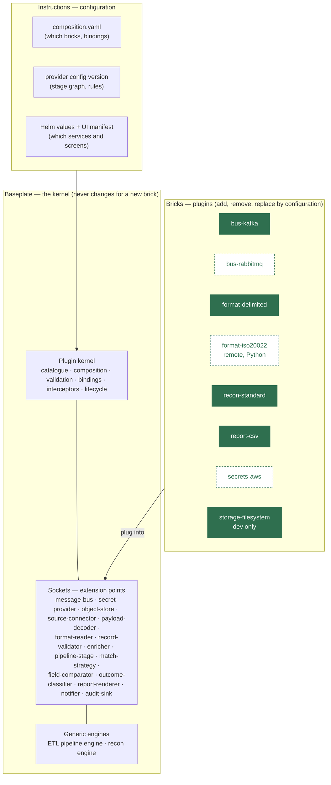
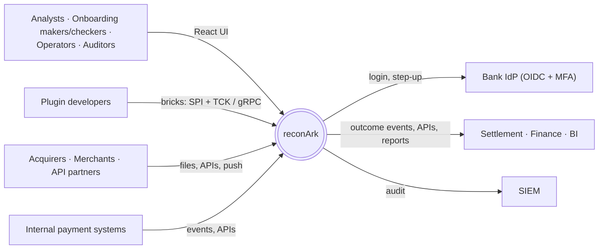
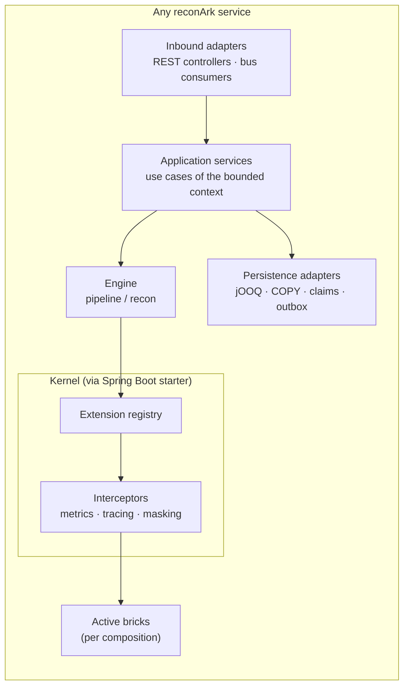
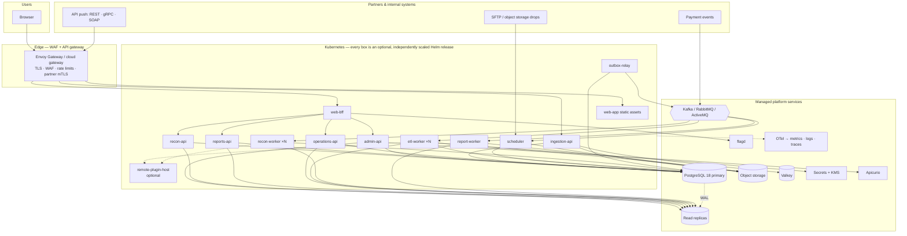
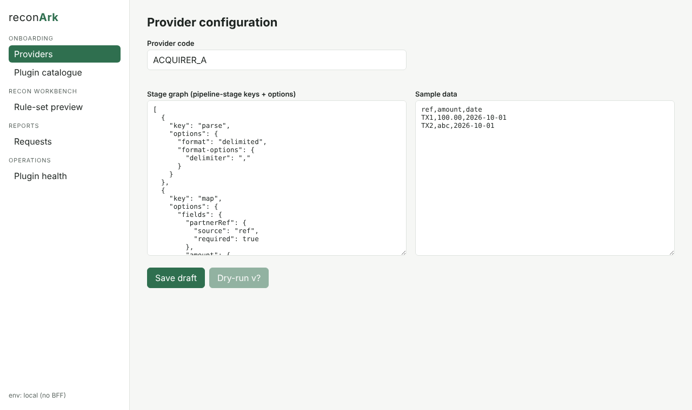

# reconArk — Solution Document

| | |
|---|---|
| Document | Solution document: composable ("Lego") ETL and reconciliation platform |
| Version | 0.2 — 2026-10-05 |
| Status | Draft for architecture review |
| Audience | Sponsors, architects, engineering leads, security, operations |
| Detailed designs | [C4 model](../c4/workspace.dsl) · [HLD](../hld/reconArk-HLD.md) · [LLD](../lld/reconArk-LLD.md) · [ADRs](../adr/README.md) · [v0.1 baseline architecture](../architecture/reconArk-architecture.md) · [Build prompt](../reference/reconArk-build-prompt.md) |

---

## Contents
1. [Executive summary](#1-executive-summary)
2. [Our understanding](#2-our-understanding)
3. [Assessment of the first version](#3-assessment-of-the-first-version)
4. [The solution in one picture: the Lego model](#4-the-solution-in-one-picture-the-lego-model)
5. [C4 model](#5-c4-model)
6. [Architecture diagram](#6-architecture-diagram)
7. [Key concepts explained](#7-key-concepts-explained)
8. [How it works, step by step](#8-how-it-works-step-by-step)
9. [Microservices and APIs](#9-microservices-and-apis)
10. [Frontend](#10-frontend)
11. [Data, security, operations](#11-data-security-operations)
12. [Technology stack: why, learning curve, alternatives](#12-technology-stack-why-learning-curve-alternatives)
13. [Enhancements recommended](#13-enhancements-recommended)
14. [Delivery roadmap](#14-delivery-roadmap)
15. [Developing with Claude Code cloud sessions](#15-developing-with-claude-code-cloud-sessions)
16. [Risks and open decisions](#16-risks-and-open-decisions)
17. [What is in the repository today](#17-what-is-in-the-repository-today)

---

## 1. Executive summary

reconArk ingests transaction data from any partner or internal system (files, APIs, queues), normalises it into one
canonical model, and reconciles it side against side by configured rules. It explains every difference and reports
on it. The scale is a few hundred to 100M+ records per run, many runs at once, each within 40 minutes.

The first version (v0.1) settled the hard engineering questions:
- data model, partitioning and ACID transactions;
- primary/replica routing;
- claims, outbox and self-healing;
- security and the three clouds.

**Version 0.2 adds what the business asked for next: a system that keeps up with change through configuration.**
Like Lego, any brick can be:
- **added** — a new file format, a new partner connector, a new comparison rule, a new report type, a new UI screen;
- **removed** — a capability an entity doesn't need;
- **replaced** — Kafka by RabbitMQ, AWS by Azure, one matching strategy by another.

None of these touch the core. The core becomes a small **plugin kernel** that knows only the *shapes of the sockets*
(extension points). Everything else is a brick plugged into a socket by configuration. The same idea applies at
every level:

| Level | Brick | Plugged in by |
|---|---|---|
| Capability | Plugin (in-process JAR, or out-of-process gRPC service) | Composition file per service |
| Processing | Pipeline stage | Provider configuration (maker-checker) |
| Service | Microservice (Admin API, Reports API, ...) | Helm values per environment |
| UI | React feature module | UI manifest per environment and role |

The repository already contains:
- a working kernel;
- the extension-point catalogue;
- configuration-driven ETL and recon engines;
- seven plugins;
- 11 Spring Boot microservices;
- a React shell with four feature modules;
- contracts, Helm and local infrastructure;
- the guard rails for AI-assisted development (`CLAUDE.md`, permissions, hooks).

## 2. Our understanding

What we understood the brief to be, confirmed at the start of this engagement:

1. **Take over the v0.1 design pack.**
   - The design pack is the architecture document, build prompt, C4 workspace, 18 diagrams and 25 ADRs.
   - Keep its decisions unless there is a reason to change them.
2. **Make reconArk composable ("Lego").**
   - Any part can be discarded when it becomes obsolete, replaced, or added, through configuration rather than
     code changes.
   - This includes components and features that are plugged in with configuration only.
3. **Expose features as separate microservices**, for example an Admin API and a Reports API, with a **React**
   front end consuming them.
4. **Design in order:** C4 model, then HLD, then LLD, then a solution document with all diagrams and every concept
   and step explained, plus tech-stack rationale, learning curve and alternatives, and recommendations to make the
   solution complete.
5. **Put the work on GitHub.**
   - Use a public repository under the client's account.
   - Copy v1 in first, as the baseline.
   - Prepare **`CLAUDE.md`, hooks and permissions** so that future development can run in **Claude Code cloud
     sessions**.

Assumptions, recorded as defaults until confirmed:

| # | Assumption |
|---|---|
| A1 | The v0.1 non-functional targets stand: 100M+ records per run, ≤ 40 min, AWS first, PostgreSQL 18, Kafka default |
| A2 | "Configurable" means without code change and without core release. A *new kind* of brick still needs its module built and deployed once, but never a change to the kernel, the engines or other bricks. |
| A3 | Hybrid plugin model: in-process for first-party and certified bricks, out-of-process for third-party or non-JVM bricks (chosen during clarification) |
| A4 | This round delivers the design plus a runnable skeleton. Persistence adapters and the remaining planned bricks follow in increments (§14). |

## 3. Assessment of the first version

| Area | v0.1 strength | Gap against the Lego goal | v0.2 answer |
|---|---|---|---|
| Ports and adapters | Bus, secrets, storage, connectors behind ports | Adapters chosen at build time; no lifecycle, validation or versioning; no third-party path | Plugin kernel with descriptors, composition, trust tiers, TCK (ADR-0026, 0035) |
| Pipelines | Excellent ETL semantics (reject-and-continue, accounting) | Step order hard-wired | Stage graph declared per provider version (ADR-0028) |
| Recon rules | Config-driven comparators in one registry | Registry specific to recon; strategy and classifier fixed | Generic extension registry: strategy, comparators, classifier are bricks |
| Services | 8 well-defined services | Grouped by technical role; APIs not split by business area; all mandatory | 12 services by bounded context, each optional; topologies (ADR-0029) |
| UI | — | Not designed | React shell + manifest-driven modules + BFF (ADR-0031, 0032) |
| Configuration | Versioned business config with maker-checker | No model for platform composition or runtime flags | Three-layer configuration model (ADR-0033, 0036) |
| Contracts | OpenAPI/proto mentioned | No event contracts, no plugin contract | `contracts/` with OpenAPI, AsyncAPI, ExtensionService proto (ADR-0034) |
| Delivery | Strong CI intent | No repository, no build, no AI-development guard rails | Repository, Gradle build, CI, `CLAUDE.md` + hooks (ADR-0037) |

Everything v0.1 decided about data, transactions, performance, messaging semantics, security controls and cloud
mapping **stays valid** and is referenced, not repeated.

## 4. The solution in one picture: the Lego model



Solid bricks exist in the repository today. Dashed bricks are designed and planned.

## 5. C4 model

The model of record is the Structurizr workspace [`docs/c4/workspace.dsl`](../c4/workspace.dsl):
- L1: system context;
- L2: containers;
- L3: admin-api, etl-worker and recon-worker components;
- dynamic views: one ETL chunk, one recon bucket;
- deployment: AWS.

Mermaid renderings follow.

### 5.1 Level 1 — System context



### 5.2 Level 2 — Containers
See [HLD §5](../hld/reconArk-HLD.md#5-c4-level-2--containers) for the full diagram and responsibility table. In
summary:
- **Edge:** the web-app (React), the api-gateway, and the web-bff.
- **Business APIs:** admin, ingestion, recon, reports, operations.
- **Engines:**
  - scheduler;
  - etl-worker;
  - recon-worker;
  - report-worker;
  - outbox-relay;
  - an optional remote-plugin-host.
- **Platform:**
  - PostgreSQL 18 primary and replicas;
  - object storage;
  - one message bus;
  - Valkey;
  - secret manager and KMS;
  - feature flags;
  - schema registry;
  - the OTel collector.

### 5.3 Level 3 — Components (the same anatomy in every service)



Detailed component views for admin-api, etl-worker and recon-worker are in the C4 workspace.

### 5.4 Level 4 — Code
The class diagrams for the plugin kernel, pipeline engine and recon engine are in [LLD §2, §4, §5](../lld/reconArk-LLD.md).

## 6. Architecture diagram



The per-cloud deployment views are unchanged from v0.1 (architecture §13; `docs/diagrams/16`–`18`). Each cloud
service is reached through a brick. For example, `storage-s3`, `storage-blob` and `storage-gcs` all plug into the
`object-store` socket, which is how the same images run on AWS, Azure and GCP.

## 7. Key concepts explained

| Concept | What it is | Example |
|---|---|---|
| **Kernel** | The small, stable core that discovers bricks, validates them and plugs them into sockets. It contains no business or infrastructure logic. | `PluginRuntime.boot(catalog, composition)` |
| **Extension point (socket)** | A typed interface with an id and a cardinality, which says what kind of brick fits | `format-reader` (KEYED), `message-bus` (SINGLE), `audit-sink` (CHAIN) |
| **Cardinality** | How many bricks may sit in a socket: SINGLE (exactly one, chosen by binding), KEYED (many, chosen by key), CHAIN (ordered list) | One bus; many formats; audit to DB, then SIEM |
| **Plugin (brick)** | A module that contributes one or more implementations to sockets, described by a descriptor | `recon-standard` contributes five comparators, a strategy and a classifier |
| **Plugin descriptor** | The brick's label: id, version, kernel API range, trust tier, `provides`, `requires`, config spec | `bus-kafka@0.2.0, CORE, provides message-bus` |
| **Trust tier** | Where a brick may run: CORE, VERIFIED, DEV_ONLY (never in prod), REMOTE (only out-of-process) | `secrets-env` is DEV_ONLY |
| **Composition** | Per-service, per-environment configuration: which bricks are enabled, their config, bindings, chains, disabled list | `config/composition/etl-worker.prod-aws.yaml` |
| **Binding** | For a SINGLE socket, which key is active | `message-bus: kafka` |
| **Config spec** | The configuration a brick accepts. It is validated at boot and rendered as JSON Schema, so the UI form is generated automatically. | `bootstrap-servers` (required), `max-deliveries` (default 5) |
| **Interceptor** | Cross-cutting behaviour wrapped around every brick call, once | Metrics `reconark.extension.calls` |
| **TCK** | The test suite every brick of a socket must pass. It is what makes bricks interchangeable. | `FieldComparatorTck`, `MessageBusTck` |
| **Remote brick** | A brick in its own container, in any language, reached over gRPC with the same SPI | A partner's Python ISO 20022 parser |
| **Pipeline / stage graph** | The ordered list of stages a provider's data flows through, declared in its configuration version | `decode → parse → map → validate → canonicalize` |
| **Error policy** | What a stage failure does: reject the record, quarantine the source, or fail the run | `decode` with `QUARANTINE_SOURCE` |
| **Accounting invariant** | `read = accepted + rejected + quarantined`, enforced by the engine | A chunk can't "lose" rows |
| **Rule set** | A configured pairing of two sources: match key, strategy, compared fields with comparators, tolerances and severities | `RS-CORE-ACQ-A` |
| **Three configuration layers** | Platform composition (Git) → business configuration (DB, maker-checker) → runtime flags (OpenFeature) | Layer 2 can only use what layer 1 installed |
| **BFF** | Backend-for-frontend. It keeps OIDC tokens server-side, routes UI calls to APIs and serves the UI manifest. | `/bff/ui-manifest` |
| **UI manifest** | Which UI modules a user sees in an environment, filtered by role | Reports hidden for an entity without reporting |
| **Claim / outbox / LSN fence** | v0.1 mechanisms for owned work, reliable events and read-your-writes on replicas | architecture §6–9 |

## 8. How it works, step by step

### 8.1 End-to-end flow: partner file to reconciled outcome

```mermaid
flowchart LR
  A[Partner drops<br/>PGP file on SFTP] --> B[scheduler<br/>source-connector brick pulls,<br/>stores raw artifact, dedupes]
  B --> C[scheduler plans chunks<br/>outbox: chunk-ready ×N]
  C --> D[etl-worker ×N<br/>claim chunk]
  D --> E[Compiled provider pipeline<br/>decode → parse → map →<br/>validate → canonicalize]
  E --> F[(COPY to staging<br/>merge to canonical,<br/>rejects, counts, outbox)]
  F --> G[scheduler finalizes run<br/>when counts balance]
  G --> H[recon planned per rule set + date<br/>outbox: bucket-ready ×M]
  H --> I[recon-worker ×M<br/>LSN fence → candidate join →<br/>recon engine with rule set bricks]
  I --> J[(outcomes, diffs,<br/>exceptions, outbox)]
  J --> K[outcome-changed events<br/>to downstream]
  J --> L[recon-api / reports<br/>for analysts]
```



Step by step:
1. **Acquire.**
   - The scheduler runs the provider's configured `source-connector` brick (for example `sftp`) on its schedule.
   - The file is streamed into the `object-store` brick and its SHA-256 is recorded.
   - If the same hash, source and business date was already received, the file is skipped unless this is a replay.
2. **Plan.**
   - The scheduler sizes the run from the file size and the measured throughput.
   - It writes the `ingestion_run` and the chunk plan.
   - It writes `chunk-ready` events to the outbox in the same transaction.
3. **Publish.** The outbox-relay publishes the events through the bound `message-bus` brick.
4. **Claim.**
   - An etl-worker receives a trigger and claims the chunk in the database (owner token plus heartbeat).
   - A duplicate message only repeats a claim attempt.
5. **Transform.**
   - The worker compiles the provider version's **stage graph** once, cached per version, and runs the chunk
     through it.
   - Each stage key resolves to a brick.
   - Bad records are rejected with every violation listed; the run continues.
6. **Persist.**
   - Accepted records are COPYed into UNLOGGED staging.
   - One transaction then does the set-based merge into canonical tables, the rejects, the counts, the claim
     completion and the outbox.
7. **Finalize.** When every chunk is complete and `read = accepted + rejected + quarantined`, the run is final and
   its commit LSN is recorded.
8. **Reconcile.**
   - Recon buckets are planned by key-hash range.
   - A recon-worker waits until its replica has replayed the required LSN, then joins the candidates on the
     replica.
   - It runs the compiled **rule set**: the strategy, comparator and classifier bricks.
9. **Outcomes.**
   - Outcome versions, diffs and exceptions are written in one transaction together with the outbox.
   - `outcome-changed` events reach downstream consumers.
   - Analysts see results through recon-api and reports.
10. **Heal.**
    - If a worker dies, its heartbeat goes stale and the reclaimer re-queues the work.
    - Poison chunks go to the DLQ after bounded retries.
    - Other runs are unaffected.

### 8.2 Onboarding a new provider, with no code
1. The maker opens **Onboarding → Providers** in the UI.
2. The maker declares the connector, decoders, format, field mappings, validators and stage order.
   - Every option form is generated from the bricks' schemas.
3. On **save**, admin-api checks that every key exists among the active bricks and validates every option against
   its schema. Errors come back per field, with `RK-*` codes.
4. On **dry-run**, the exact production pipeline runs on a sample. The maker sees accepted and rejected counts,
   reasons, and a masked preview.
5. The maker **submits**.
   - A *different* checker approves, with step-up MFA.
   - The approval is bound to the content hash.
6. The version **activates** at its effective date. A `config-changed` event tells the workers to load the new
   version.

### 8.3 Replacing a brick (example: Kafka to RabbitMQ)
1. Edit the composition (`bus-kafka` → `bus-rabbitmq`, `bindings.message-bus: rabbitmq`) in a pull request.
2. CI builds, runs the `MessageBusTck` against RabbitMQ, and lints the composition.
3. Two reviewers approve and the change is merged. Argo CD rolls the services.
4. The kernel validates at boot.
   - If anything is wrong, the new pods never become ready and the old ones keep serving.
5. The outbox republishes anything not yet published. Consumers deduplicate.

### 8.4 Adding a new brick (example: ISO 20022 reader as a remote Python plugin)
1. The partner team implements `ExtensionService` (gRPC) in Python, contributing `format-reader:iso20022`.
2. The CI pipeline runs the format-reader TCK over gRPC, then signs the image.
3. The platform team adds the deployment and a `remote` composition entry for etl-worker.
4. Onboarding makers can now pick `format: iso20022`. The kernel sends masked data unless sensitive fields are
   explicitly approved.

### 8.5 Removing a capability (example: an entity without reporting)
1. Set `enabled: false` for reports-api and report-worker in that environment's Helm values.
2. Remove the `reports` module from the UI manifest.
3. Nothing else changes. The other services never referenced reporting code.

## 9. Microservices and APIs

| Service | Bounded context | API (all behind the gateway and BFF; ops internal only) |
|---|---|---|
| **admin-api** | Onboarding and configuration | `/api/admin/v1`: plugins, extension points, providers and versions, dry-run, submit, approve (rule sets, reference data and compositions follow the same pattern) |
| **ingestion-api** | Partner push | `/api/ingestion/v1/sources/{id}/batches` (REST; gRPC and SOAP endpoints planned) |
| **recon-api** | Recon results | `/api/recon/v1`: preview, comparators (results, diffs, exceptions and re-recon planned) |
| **reports-api** | Reporting | `/api/reports/v1`: formats, requests (schedules and downloads planned) |
| **operations-api** | Operations | `/api/ops/v1`: plugins, kernel health (runs, replay and DLQ planned) — internal listener |
| **web-bff** | Browser edge | `/bff/me`, `/bff/ui-manifest`, `/api/{context}/**` |
| **scheduler, etl-worker, recon-worker, report-worker, outbox-relay** | Processing | Event-driven through the active `message-bus` brick |

API conventions:
- contract-first, under `contracts/`;
- RFC 9457 errors with stable `RK-*` codes;
- `Idempotency-Key` on every mutation;
- cursor pagination;
- `/v1` URL versioning, with additive changes only.

See LLD §8–10.

## 10. Frontend



- **React 19 + TypeScript + Vite** shell; feature modules are separate, lazily loaded bundles.
- The **UI manifest** from the BFF decides which modules each user sees in each environment.
- The **schema-driven forms** mean a new brick's configuration UI appears automatically.
- The **BFF token handler** keeps tokens out of the browser. The browser holds only an HttpOnly cookie, and CSRF
  protection is on.
- **Module Federation** can turn modules into independently deployed remotes later, with the same module contract
  (ADR-0032).

## 11. Data, security, operations

- **Data.** These v0.1 decisions are unchanged:
  - PostgreSQL 18 as the single system of record, with partitioning configured per table;
  - writes on the primary, reads on replicas with LSN fencing;
  - ACID transactions with deliberate isolation levels.

  New in v0.2:
  - a **schema per bounded context**, with ownership enforced by database roles (ADR-0030);
  - tables recording compositions and stage graphs (LLD §11).
- **Security.** All v0.1 controls remain (OIDC, MFA, step-up, ABAC + RLS, mTLS, signed partner requests, the VAPT
  checklist, CMK). New in v0.2:
  - plugin trust tiers;
  - signed and allow-listed bricks;
  - remote bricks isolated by mTLS and network policy, with masked data by default;
  - the BFF token handler;
  - plugin configuration validated against its schema;
  - secrets as reference names only.
- **Operations.** v0.1 OpenTelemetry, SLOs and runbooks, plus:
  - per-brick metrics (`reconark.extension.calls`);
  - `/actuator/plugins` and `operations-api` inventory and health;
  - composition drift is visible because each service records what it booted with.

## 12. Technology stack: why, learning curve, alternatives

Learning curve is rated for a typical Java/Spring and React team: **Low** = productive in days, **Medium** = weeks,
**High** = months.

| Concern | Choice | Why it fits | Learning curve | Alternatives, and when to choose them |
|---|---|---|---|---|
| Language/runtime | **Java 25 LTS** | Mature, the team's skills, virtual threads for IO-bound work, strong ecosystem for PGP/SFTP/Kafka | Low | **Kotlin** (more concise, same JVM; Medium); **Go** for remote bricks only (fast, small images; Medium) |
| Framework | **Spring Boot 4.1** | Auto-configuration is itself a composition mechanism, so it fits the kernel starter; first-class security, actuator, observability | Low | **Quarkus** (faster start, native images, good for workers; Medium); **Micronaut** (compile-time DI; Medium) |
| Plugin model | **Own kernel on Java SPI + Spring starter; gRPC for remote** (ADR-0026) | Zero dependencies, fail-fast validation, trust tiers, works in tests and in any host; gRPC gives polyglot bricks | Low (SPI) / Medium (gRPC) | **PF4J** (runtime JAR hot-load; Medium; choose if bricks must be added without redeploy); **OSGi** (High; not recommended); **WASM plugins (Extism/Chicory)** (sandboxed polyglot in-process; Medium–High; watch for maturity) |
| Pipeline engine | **Own engine on the kernel** (ADR-0028) | Fits the claim/COPY/accounting invariants and the 40-minute budget | Low | **Apache Camel** (300+ connectors; Medium; wrap Camel components as `source-connector` bricks if many protocols are needed); **Spring Batch** (rejected in v0.1 ADR-0015); **Temporal** for long-running human workflows such as exception handling (Medium) |
| Expressions | **CEL** (v0.1 ADR-0012) | Sandboxed by design, linear-time, used for validators and comparator expressions | Low | **SpEL** (rejected: not sandboxed); **JEXL** (needs hardening) |
| Database | **PostgreSQL 18** (Aurora / Flexible Server / AlloyDB) | ACID, partitioning, replicas, set-based recon joins | Low | **Citus / YugabyteDB** if one primary can't meet the write budget (ADR-0024; Medium–High) |
| Data access | **jOOQ + COPY** | Typed SQL, predictable statements, bulk load | Medium | **Spring Data JDBC** for simple config CRUD (Low); JPA rejected on hot paths |
| Messaging | **Kafka 4 (KRaft)** default; RabbitMQ / ActiveMQ bricks | Partitioned parallelism, per-key order, replay | Medium | **Redpanda** (Kafka API, simpler operations; Low switch); **RabbitMQ** (simpler, lower throughput; Low) |
| Cache | **Valkey** | Nonces and rate limits only, never a system of record | Low | Redis, managed equivalents |
| API edge | **Envoy Gateway** or cloud gateway + WAF | Kubernetes Gateway API standard, mTLS, rate limits | Medium | **Spring Cloud Gateway** (Java team familiarity; Low); **Kong** (rich plugins; Medium); **Apigee/APIM** (managed; Medium) |
| BFF | **Spring Boot + Spring Security OAuth2 Client** | Token-handler pattern, CSRF, route table as configuration | Low | **Node (Fastify) BFF** if the UI team owns it (Low for JS teams) |
| Identity | **Bank IdP (OIDC)**; **Keycloak** locally | Standard OIDC with MFA and step-up | Medium | Entra ID, Okta, Ping |
| Feature flags | **OpenFeature + flagd** (ADR-0033) | Vendor-neutral, self-hosted | Low | Unleash (UI, self-hosted; Low); LaunchDarkly (SaaS; Low) |
| Contracts | **OpenAPI 3.1, AsyncAPI 3, Protobuf; Apicurio Registry** | Contract-first; breaking-change detection | Low–Medium | Confluent Schema Registry (licence terms) |
| Frontend | **React 19 + TypeScript + Vite + TanStack Query + React Router 7** | Largest talent pool, fast builds, lazy module chunks | Low | **Angular** (opinionated enterprise framework; Medium–High); **Next.js** (only if SSR or SEO is needed; Medium) |
| UI components | **Mantine** recommended (skeleton uses plain CSS tokens until the UI-kit ADR) | Rich data components, theming, accessible | Low | **MUI** (Material look; Low); **Ant Design** (dense enterprise tables; Low); **AG Grid** for very large grids (Medium) |
| Micro-frontends | **Build-time modules now → Module Federation 2 later** | Same contract either way | Low → Medium | **single-spa** (Medium) |
| Build | **Gradle 9.8 Kotlin DSL** + convention plugins; **npm workspaces** | One version catalog, reusable conventions | Medium | Maven (Low, less flexible); **pnpm** for faster frontend installs (Low) |
| Testing | JUnit 5, AssertJ, **plugin TCK**, ArchUnit, Testcontainers, Vitest, Playwright | Conformance plus boundaries plus real infrastructure | Low–Medium | jqwik for property-based batch/stream equivalence (Low) |
| Observability | **OpenTelemetry** → Prometheus, Grafana, Loki, Tempo (or cloud backends) | Vendor-neutral, end to end | Medium | Datadog / Dynatrace agents (Low; lock-in) |
| Delivery | **Terraform/OpenTofu + Helm (one chart) + Argo CD + KEDA** | GitOps, scale on lag | Medium | Flux (Medium); Crossplane (High) |
| Supply chain | **CodeQL, Gitleaks, dependency review, SBOM (CycloneDX), cosign** | VAPT readiness; signed bricks | Low | SonarQube (v0.1, also fine), Snyk |
| AI-assisted development | **Claude Code cloud sessions** + `CLAUDE.md`, hooks, permissions | Rules versioned with the code; same gates as humans | Low | — |

**When the learning curve or feasibility is a concern:**
- **The team is new to Kafka.** Start on RabbitMQ through `bus-rabbitmq`, which is a composition change, and move
  to Kafka when volumes need it.
- **The team is new to jOOQ.** Use Spring Data JDBC for the configuration context and keep jOOQ and COPY for the hot
  paths only.
- **Micro-frontends are premature.** Keep build-time modules, which is what the repository does today. The module
  contract already allows the later switch.
- **Kubernetes skills are thin.** Use managed Kubernetes (EKS Auto Mode, AKS Automatic, GKE Autopilot) and the one
  generic Helm chart.

## 13. Enhancements recommended

Already in v0.2:
- the plugin kernel;
- the TCK;
- configuration-declared pipelines;
- bounded-context microservices;
- the BFF;
- the manifest-driven UI;
- the three configuration layers;
- contracts;
- the AI-development guard rails.

Recommended next, in priority order:

| # | Enhancement | Value | Effort |
|---|---|---|---|
| E1 | **Persistence adapters and walking skeleton**: one provider end to end on PostgreSQL + Kafka with the full security model | Proves the 40-minute model early | M |
| E2 | **Composition lint and drift report**: CI validates every composition against installed bricks; services record their booted composition | Catches config mistakes before deploy | S |
| E3 | **Mapping Studio UI**: visual record-root and JSONPath picker over a sample, generating the `map`/`extract` stages | Faster onboarding, fewer errors | M |
| E4 | **Rule Designer UI**: drag comparators from `/comparators`, with live preview through recon-api | Business users author rule sets safely | M |
| E5 | **Remote-bridge module + Python/Go brick SDKs** | Partner-built bricks without JVM skills | M |
| E6 | **Exception workflow on Temporal or a state-machine brick**, with SLAs, assignment and escalation | Operational efficiency | M |
| E7 | **Multi-tenancy** (`tenant_id` on every table and the composition; RLS by tenant) | Serve several bank entities from one platform | L |
| E8 | **AI-assisted onboarding brick** (off by default, masked samples only): suggests field mappings and rules for human approval | Faster onboarding; human-in-the-loop | M |
| E9 | **Analytics export brick**: outcomes to Parquet/Iceberg for BI, off the OLTP path | Removes report load from PostgreSQL | M |
| E10 | **Self-service brick marketplace page**: catalogue with TCK status, signatures, compatibility matrix | Governance at scale | S |
| E11 | **Chaos and game-day suites in CI** (kill workers mid-chunk; broker loss) | Proves self-healing | M |
| E12 | **Consumer-driven contract tests** (BFF ↔ APIs, downstream ↔ events) | Safe independent releases | S |

## 14. Delivery roadmap

```mermaid
gantt
  title reconArk delivery increments (indicative)
  dateFormat YYYY-MM-DD
  axisFormat %b %d
  section Foundation
  v0.2 design + composable skeleton (this delivery)      :done, f1, 2026-10-05, 1d
  CI green on Java 25 + Spring Boot 4.1, first images      :f2, after f1, 7d
  section Walking skeleton
  Persistence adapters (jOOQ, COPY, claims, outbox, LSN)   :w1, after f2, 21d
  One provider end to end + report + full security          :w2, after w1, 21d
  section Bricks and UI
  Production bricks: secrets-aws, storage-s3, decoder-pgp, sftp, format-json :b1, after f2, 28d
  Mapping Studio + Rule Designer                            :u1, after w2, 28d
  Remote bridge + partner SDK                               :b2, after w2, 21d
  section Scale and hardening
  Performance harness 100 to 100M, noisy neighbour          :p1, after w1, 28d
  Chaos suite, DAST, VAPT readiness                         :p2, after w2, 21d
```

Each increment ends with its acceptance tests green, its ADRs accepted and its documentation updated in the same
pull request.

## 15. Developing with Claude Code cloud sessions

Everything a future session needs is in the repository (ADR-0037):

| File | Purpose |
|---|---|
| [`CLAUDE.md`](../../CLAUDE.md) | Architecture rules (the Lego rules), repository map, commands, conventions, definition of done |
| [`.claude/settings.json`](../../.claude/settings.json) | Permissions (allow / ask / deny) and hooks |
| `.claude/hooks/session-start.sh` | Cloud sessions only: checks Java 25, prepares Gradle and npm, prints the working agreement |
| `.claude/hooks/guard-files.py` | Blocks edits to accepted ADRs, the v0.1 reference, lockfiles and secret files |
| `.claude/hooks/guard-bash.py` | Blocks force-push, pushes to `main`, destructive commands, TLS bypass, `curl \| sh` |
| `.claude/hooks/post-edit.py` | Formats frontend files; scans every edited file for secrets and legacy names |
| `.claude/hooks/stop-verify.sh` | Fast verification before a session ends (frontend typecheck/tests and/or Gradle `verifyQuick` for what changed) |
| `.claude/commands/*.md` | `/new-plugin`, `/new-service`, `/new-ui-module`, `/new-adr`, `/verify`, `/design-review` |
| `.claude/agents/*.md` | `architecture-reviewer`, `security-reviewer` subagents |

**Cloud environment setup (one time).** The Claude Code cloud environment needs **Trusted** network access, which
includes Maven Central, the Gradle services and npm. If an organisation uses a Custom allowlist, it must include:
- `repo.maven.apache.org`
- `plugins.gradle.org`
- `services.gradle.org`
- `registry.npmjs.org`
- the Ubuntu archive, for JDK 25

The recommended setup script is in `CLAUDE.md`.

## 16. Risks and open decisions

| Risk | Mitigation |
|---|---|
| Brick sprawl or uneven quality | TCK per socket, trust tiers, review checklist, deprecation policy |
| Version drift between kernel and bricks | Kernel API ranges, boot-time checks, compatibility matrix in CI |
| Configuration complexity | Schema-driven UI, dry-run, composition lint, golden compositions |
| Remote-brick latency | Batching, deadlines, circuit breakers, kept off the hot path unless measured |
| Spring Boot 4 / Java 25 early-adoption issues | Pinned versions in one catalog, CI on every change, ADR-0013 revisit triggers |
| Single PostgreSQL primary write ceiling | v0.1 admission control and ADR-0024 sharding by provider group |

Open decisions:
- the v0.1 list (architecture §16);
- the UI component kit (Mantine recommended);
- the in-cluster gateway (Envoy Gateway or a managed cloud gateway);
- whether multi-tenancy (E7) is in scope for the first release.

## 17. What is in the repository today

| Area | State | Verified how |
|---|---|---|
| Kernel, pipeline engine, recon engine, SPI | Implemented | 90 unit/TCK tests passing locally (JDK 25); CI runs them on every push |
| Plugins: recon-standard, format-delimited, bus-inmemory, secrets-env, storage-filesystem, report-csv | Implemented, TCK-tested | As above |
| Plugin: bus-kafka | Implemented | Compiles in CI; broker TCK in the integration suite (roadmap) |
| Spring Boot starter, API support, 11 services | Implemented (skeleton level, see LLD §8.1) | CI build + admin-api `@SpringBootTest` |
| React shell + 4 modules | Implemented | `tsc`, Vitest, Vite build; screenshot above |
| Contracts, compositions, Helm chart, docker-compose | Written | Lint in CI (roadmap) |
| Persistence adapters, production cloud bricks, remote bridge | Designed, not yet implemented | Roadmap §14 |
